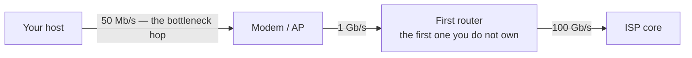
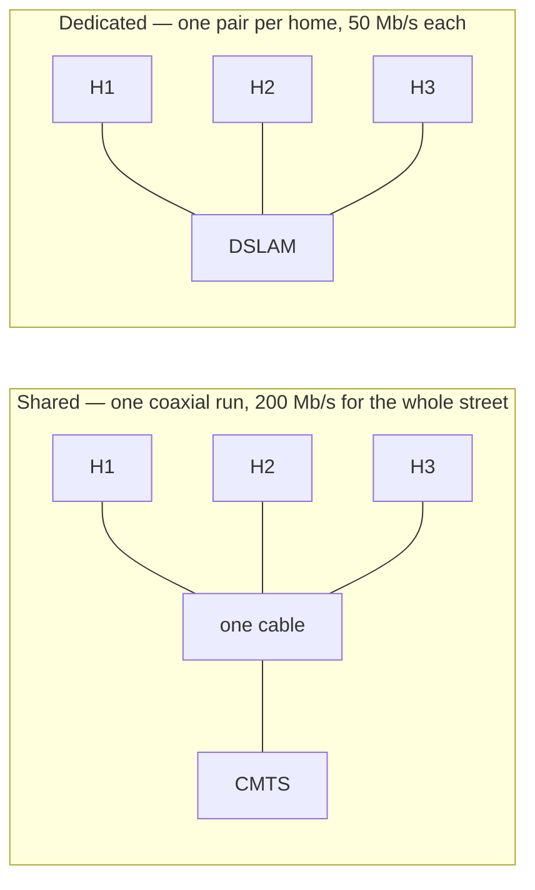

The **access network** joins the [[Network Edge]] to the [[Network Core]]: the link from your host to the **first router you do not own**. Everything beyond that router is your provider.

It is normally the **slowest hop on the whole path**, often two or three orders of magnitude below the core. This one link usually sets the [[Bottleneck Link|bottleneck]]:

*Typical rates along one path: the first link is slower by a factor of a thousand, and this one link sets what you get.*

**Shared vs dedicated capacity** — the difference is not the diagram, it is *how many physical media there are*:

| | Shared (cable / coax) | Dedicated (DSL twisted pair) |
|---|---|---|
| Medium | One coaxial run tapped by the whole street | One pair per home, all the way to the exchange |
| One home active | 200 Mb/s | 50 Mb/s |
| Six homes active | ~33 Mb/s each | 50 Mb/s each |
| Terminates at | CMTS | DSLAM |

One pipe to divide, or one pipe each. That is why cable slows at 8pm and a dedicated line does not.
