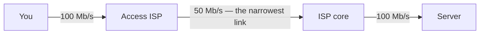

The **bottleneck** is the narrowest link on the path, and it alone sets the [[Throughput]]:

$$\text{throughput} = \min\{R_1, R_2, \dots, R_n\}$$

A path of 100, 1 and 100 Mb/s delivers **1 Mb/s**. Watch the packets *after* the narrowest link: they stay spread out even though the last link is fast, because nothing can arrive faster than the bottleneck let it through.

> [!warning] Only the bottleneck is worth paying for
> Raising the rate of a link that is not the bottleneck changes nothing at all. Diagnosing *which* link it is comes before spending anything — on a typical home path it is the [[Access Network]].

$$\text{throughput} = \min\{R_1, R_2, R_3\} = 50 \text{ Mb/s}$$

*Watch the packets **after** the narrowest link: they stay spread out even though that last link is fast, because nothing can arrive faster than the bottleneck let it through. Raising the rate of a link that is not the bottleneck changes nothing at all — which is why diagnosing which link it is comes before spending anything.*
