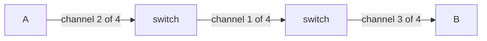

In **circuit switching**, every link is a stack of channels, and **one is reserved for you on every link of the path** before a single bit moves. It stays yours until you hang up.

- Setup is **required** — a channel is claimed on each link first (not necessarily the same one; the switch maps yours through)
- You get **exactly your channel's rate**, guaranteed and constant
- While you are silent your channel sits **idle and nobody else may use it**

Built from [[Frequency-Division Multiplexing]] or [[Time-Division Multiplexing]]. It trades utilization for predictability — the opposite of [[Packet Switching]].

*Setup first: a channel is claimed on **every** link of the path before a single bit moves — and not the same channel on each, since the switch maps yours through. It stays yours until you hang up, so when you stop talking your channel empties but nobody else may use it.*
