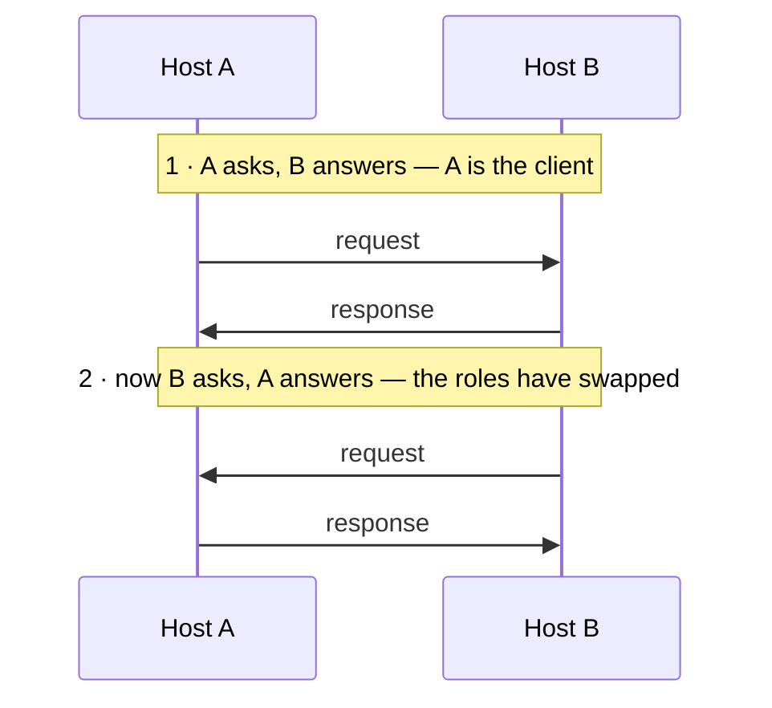

**Client** and **server** are **roles in one exchange**, not kinds of machine. The side that asks is the client; the side that answers is the server.

The same [[Host]] plays both, often at the same time: A requests and B responds, then B requests and A responds — the roles have swapped and nothing else has.

*Nothing about the machines changed between the two halves — only which side spoke first.*
