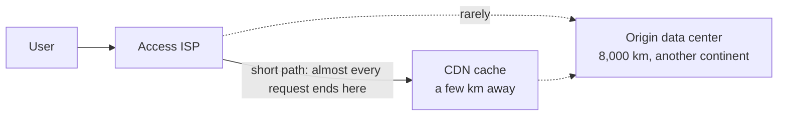

A **CDN** holds copies of content **near the viewer** — typically a cache inside your access ISP, a few kilometers away rather than a continent.

Serving every request from a single origin on another continent pays four costs, on every request:

1. **Distance is physics** — 8,000 km of fiber is ~40 ms each way, and no amount of bandwidth reduces it ([[Propagation Delay]])
2. **Every viewer pays it again** — a million viewers means a million identical copies over the same long-haul links
3. **The origin is one bottleneck** — one server farm, one link everyone squeezes through
4. **[[Transit]] costs real money** — per byte, across other networks

This is why a faster link cannot fix a long path: only a **shorter path** moves propagation delay.

*Four costs a single distant origin pays on **every** request: distance is physics (8,000 km of fiber is ~40 ms each way); a million viewers means a million identical copies over the same long-haul links; the origin is one bottleneck; and transit costs real money per byte. Putting a copy next to the viewer removes all four.*
