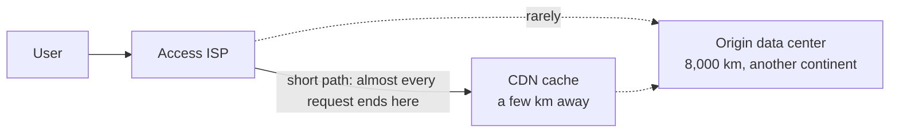
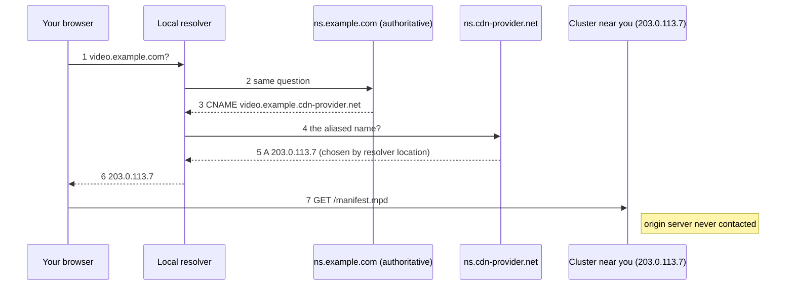

A **CDN** holds copies of content **near the viewer** — typically a cache inside your access ISP, a few kilometers away rather than a continent.

Serving every request from a single origin on another continent pays four costs, on every request:

1. **Distance is physics** — 8,000 km of fiber is ~40 ms each way, and no amount of bandwidth reduces it ([[Propagation Delay]])
2. **Every viewer pays it again** — a million viewers means a million identical copies over the same long-haul links
3. **The origin is one bottleneck** — one server farm, one link everyone squeezes through
4. **[[Transit]] costs real money** — per byte, across other networks

This is why a faster link cannot fix a long path: only a **shorter path** moves propagation delay.

```mermaid
flowchart LR
  U["User"] --> ISP["Access ISP"]
  ISP -->|"short path: almost every request ends here"| CDN["CDN cache<br/>a few km away"]
  ISP -.->|"rarely"| O["Origin data center<br/>8,000 km, another continent"]
  CDN -.-> O
```
*Four costs a single distant origin pays on **every** request: distance is physics (8,000 km of fiber is ~40 ms each way); a million viewers means a million identical copies over the same long-haul links; the origin is one bottleneck; and transit costs real money per byte. Putting a copy next to the viewer removes all four.*

**Chapter 2 additions:** two ways to place the copies.

| Strategy | Example | Buys | Costs |
|---|---|---|---|
| **Enter deep** | Akamai: small clusters inside thousands of access ISPs | shortest path to the user | thousands of sites to feed and monitor in networks it doesn't own |
| **Bring home** | Limelight: a few large clusters at [[Internet Exchange Point\|exchange points]] | a handful of sites to staff and upgrade | a longer trip for every byte (~6× in the slide's example) |

**Steering** each request to the nearest copy is done with [[DNS]], not routing: the content company's name server answers with a CNAME pointing into the CDN, whose name servers pick a cluster based on who's asking.

*How a request reaches the nearest copy (slide 83)*

```mermaid
sequenceDiagram
    participant B as Your browser
    participant R as Local resolver
    participant N as ns.example.com (authoritative)
    participant C as ns.cdn-provider.net
    participant X as Cluster near you (203.0.113.7)
    B->>R: 1 video.example.com?
    R->>N: 2 same question
    N-->>R: 3 CNAME video.example.cdn-provider.net
    R->>C: 4 the aliased name?
    C-->>R: 5 A 203.0.113.7 (chosen by resolver location)
    R-->>B: 6 203.0.113.7
    B->>X: 7 GET /manifest.mpd
    Note right of X: origin server never contacted
```

Built entirely from earlier parts: CNAME + load distribution ([[DNS Resource Record]]), ordinary [[HTTP]], and a [[Web Cache]] placed somewhere useful on purpose.

> [!warning] Limitation
> The CDN sees your **resolver's** location, not yours. A user whose resolver is in another country gets steered there.
