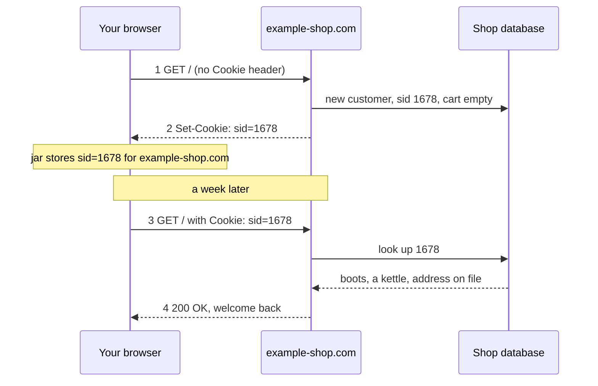

A **cookie** is a number the server makes up, hands to the browser, and gets back on every later request. It carries state *in the messages*, so a stateless [[HTTP]] server can recognize a returning user without steering them to one machine.

**Four pieces:**
1. `Set-Cookie` header in a **response**: the server creates it; nothing on your machine invents it.
2. The browser's **cookie jar** stores it per site (name, value, domain, path, expiry, flags), without asking you.
3. A `Cookie` header on **every later request** to that site: name and value only; attributes stay home.
4. A **row in the site's database**, keyed by the number: the cookie is the key, this is what it opens.

*Cookie set on first visit, returned a week later (slide 35)*

The number carries no information about you. Deleting the cookie throws away your key, **not their record**. See [[Session]] and [[Third-Party Cookie]].
