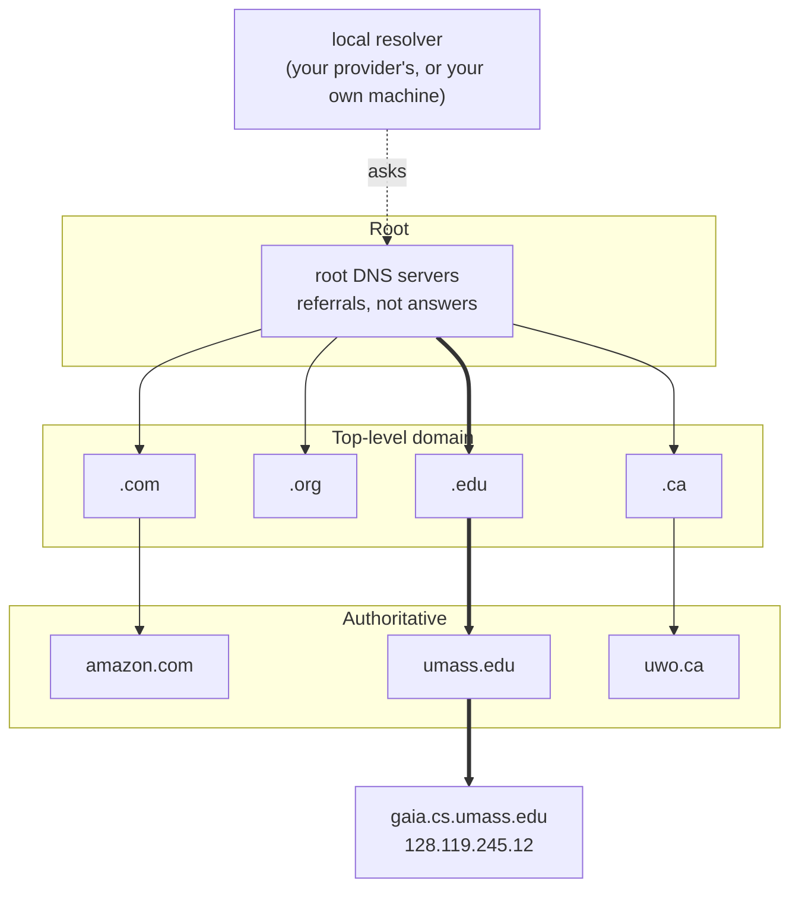

Three tiers of servers, plus the **local resolver** that does the asking (not itself a tier).

- **Root**: 13 *names*, not machines; each is hundreds of copies. Gives referrals, not answers.
- **Top-level domain (TLD)**: `.com` · `.org` · `.edu` · `.ca`; knows the authoritative server for every domain under it.
- **Authoritative**: every organization runs its own; holds the actual records.
- **Local resolver**: your provider's or your own machine; queries the hierarchy on your behalf.

*The DNS hierarchy (slide 46)*

Resolution walks this tree by [[Iterated DNS Query|iterated]] or [[Recursive DNS Query|recursive]] queries, cut short by [[DNS Caching]].
