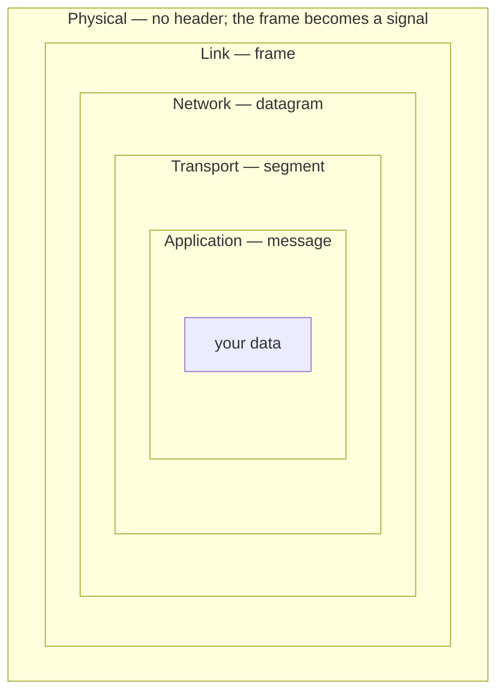

**Encapsulation**: each layer wraps what it is given **without ever opening it**, and the receiver unwraps in exactly the reverse order.

*Sender wraps outward → ← receiver unwraps inward. Each box is sealed by the layer outside it and never opened until the matching layer at the far end.*

**The same idea, header by header.** The payload stays in one column; what changes is the headers accumulating in front of it and the name the unit carries:

| Layer | Unit | Contents |
|---|---|---|
| Application | **message** | `M` — the payload as the program wrote it |
| Transport | **segment** | `Hₜ` + `M` — the message, wrapped whole |
| Network | **datagram** | `Hₙ` + `Hₜ` + `M` — the segment, wrapped whole |
| Link | **frame** | `Hₗ` + `Hₙ` + `Hₜ` + `M` — the datagram, wrapped whole |
| Physical | **bits** | No header; the frame becomes a signal |

Host B's application receives `M`, byte for byte what was sent. See [[Protocol Layering]].
