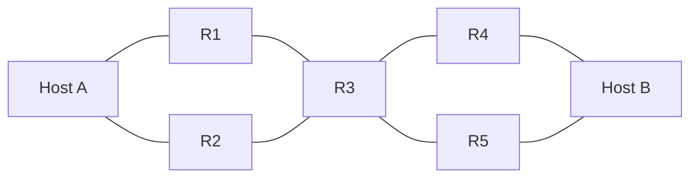

**Forwarding** is **local**: moving one packet from an input port to an output port, billions of times a second, in **microseconds**.

The [[Router]] matches the destination against its **forwarding table** and sends the packet out the matching link:

| Prefix | → |
|---|---|
| `10.0.9.0/24` | to R4 |
| `10.0.1.0/24` | to R1 |
| `default` | to R4 |

Read a row as *packets for that block leave by this link*; `default` is the row that matches everything else. Contrast [[Routing]], which decides what goes *in* the table.

R3's forwarding table, for a packet bound for B arriving from R1:

| Destination block | Leaves by |
|---|---|
| `10.0.9.0/24` | to R4 |
| `10.0.1.0/24` | to R1 |
| `default` | to R4 |

*One router, one packet, microseconds. Read a row as *packets for that block leave by this link*; `default` matches everything else. No single router chose the path A → R1 → R3 → R4 → B — each computed its own table and together they agree (see [[Routing]], which runs on a timescale of seconds to minutes).*
