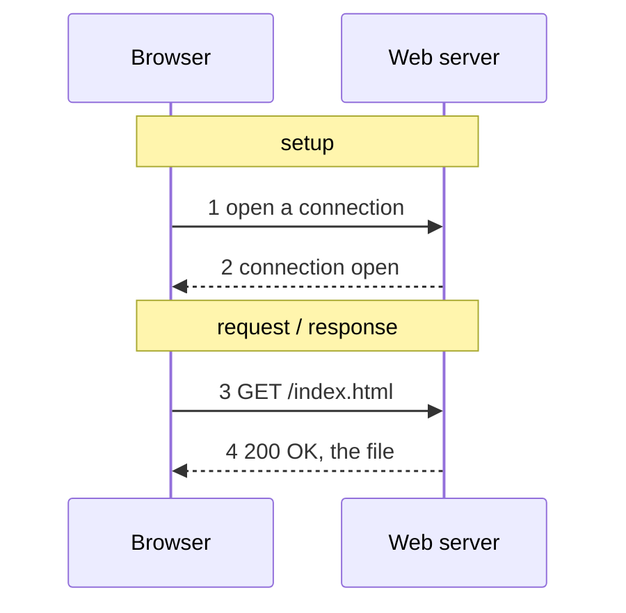

**HTTP** (HyperText Transfer Protocol) is the Web's application-layer protocol: a client asks for an object by its path, and a server returns it or explains why not. Both messages are plain text.

- **Runs over [[TCP]]**: a page with one missing byte is not a page.
- **Stateless**: the server treats each request as if it had never heard from you. This is what let the Web scale (any machine behind a name can answer), and why a shopping cart needs [[Cookie|cookies]].

A web page is **not a file**: it's a base HTML file plus the objects it references (e.g. one example page = 9 objects, 1,055 kB, from 3 servers, in two rounds). Objects in the HTML can't be requested until the HTML has arrived and been read, and that **dependency**, not the byte count, drives load time.

*One HTTP exchange (slide 21)*

