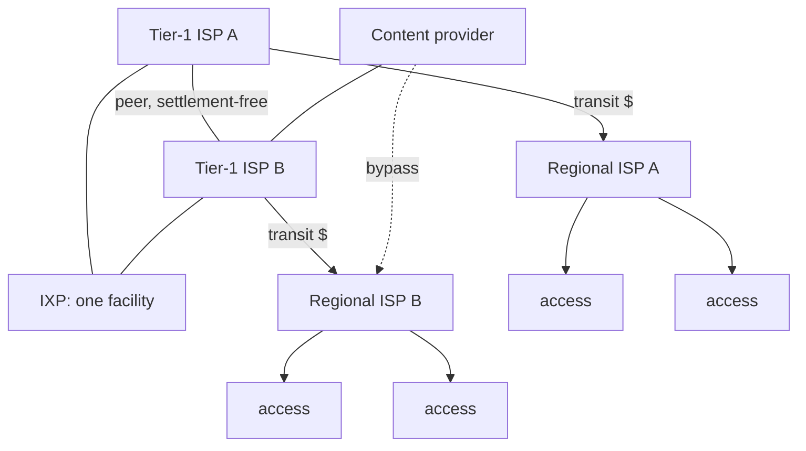

An **Internet Service Provider (ISP)** is a company that owns a network of links and routers and sells two things:

- **Access** — connecting a customer to that network (you pay your ISP)
- **[[Transit]]** — carrying the customer's traffic onward to networks the provider does not own (your ISP pays the network beyond it)

Every ISP therefore stands in one of three relationships to any other: **customer**, **supplier**, or **[[Peering|peer]]**.

> [!warning] Why not just connect everyone to everyone
> A full mesh needs $\frac{N(N-1)}{2}$ links — 28 links for 8 networks (the deck's interactive default), half a million for a thousand. Nobody builds that and nobody could pay for it, which is why the hierarchy exists.

The structure of [[The Internet]] is what those relationships add up to:

- **Access ISPs** at the edge, buying reach from
- **Regional ISPs**, buying reach from
- **Tier-1 ISPs** — global reach, buy transit from nobody, peer with each other settlement-free
- **Content providers** (Google, Meta, Akamai) run private networks that bypass the chain entirely — see [[Content Delivery Network]]

*Each tier buys reach from the one above it, except the tier-1s, who buy from nobody. **Money flows up; routes flow down.***
