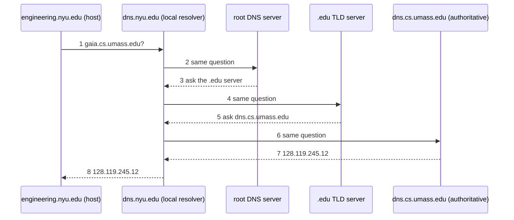

In an **iterated query**, each server the resolver contacts answers with a **referral** (the name of a server that knows more), not the address. The local resolver does all the asking. This is the one used in practice.

*Iterated resolution of gaia.cs.umass.edu (slide 47)*

Every server above the resolver answered once from what it already knew, and forgot the question. Contrast [[Recursive DNS Query]].
