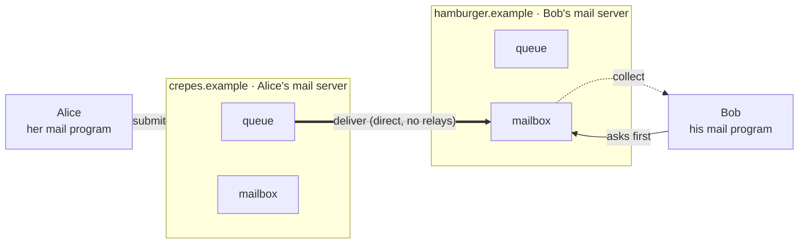

A **mail server** is the always-on, always-reachable machine (run by the user's organization) that exists because the recipient isn't there when mail arrives. Mail has three components: **user agents** (mail programs), **mail servers**, and the protocols between them.

Sending straight to Bob's machine fails: it would need to be switched on, connected, reachable from outside, and running a server at the moment Alice presses send, and typically none of those hold.

Each mail server has two boxes:
- **Outgoing queue**: messages to deliver elsewhere, retried until accepted. Filled and drained by the push protocol ([[SMTP]]).
- **Mailbox**: messages waiting for the user. Drained by a pull protocol ([[IMAP]] / [[POP]]).

Two boxes, two protocols: that's why mail needs two where the Web needed one.

*One message, three hops (slide 60)*

Hops 1–2 are **pushed** (sender initiates, all the way to Bob's server); hop 3 is **pulled** (Bob initiates, whenever he looks). Alice's server is a server all day and a *client* for the 30 s it spends delivering, which shows [[Client and Server|client and server]] are roles.
