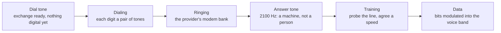

A **modem** (**mod**ulator–**demod**ulator) converts your network's bits into a signal the line to your provider can carry, and back: DSL over the phone pair, cable over coax, fiber over glass.

It changes the **signal, never the destination**. Forwarding decision: **none**.

**Dial-up, for context:** the telephone network carried a 300–3400 Hz audio channel and nothing else, so bits had to become sound. That channel capped an all-analog modem at **33.6 kb/s**; the later **56 kb/s** came from the provider sitting on the phone network's own digital trunk and skipping the analog hop downstream (8,000 samples/s × 7 usable bits). A 1,500-byte packet — a tenth of a millisecond on a 100 Mb/s link — took **214 ms** at 56 kb/s.

**The dial-up handshake, phase by phase** — the sound it made while connecting was a protocol exchange, and every part of it was audible:

