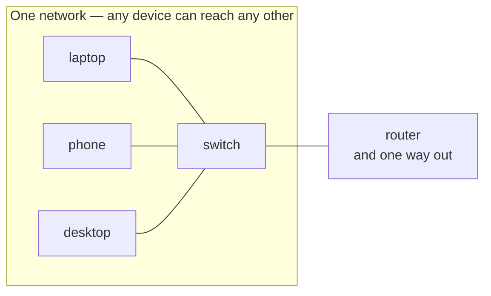

A **network** is a set of **devices** joined by **links**, together with the **rules** they follow, such that any device can exchange data with any other.

All three parts are required:
- Devices with no link cannot reach each other
- A link with no agreed [[Protocol]] carries signals neither end can interpret

> [!tip] The definition is the whole test
> A laptop and a printer on one Ethernet cable speaking IP *are* a network — but not part of [[The Internet]], because nothing joins them to a second network.

*All three parts are required: devices with no link cannot reach each other, and a link with no agreed rules carries signals neither end can interpret.*
