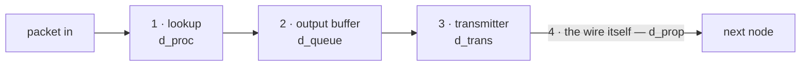

Wherever a packet leaves a node — a router, or your own machine — up to four separate things hold it up at the **output port** (one physical interface: the link, not a number):

$$d_{nodal} = d_{proc} + d_{queue} + d_{trans} + d_{prop}$$

| # | Delay | Formula | What is happening |
|---|---|---|---|
| 1 | [[Processing Delay]] | µs | Read the header, check for errors, pick the outgoing link. Nothing has moved yet |
| 2 | [[Queueing Delay]] | $N \times L/R$ | Packets already queued for that link go first |
| 3 | [[Transmission Delay]] | $L/R$ | Push the packet onto the wire, one bit at a time |
| 4 | [[Propagation Delay]] | $d/s$ | The bits cross the length of the link |

**Across a whole path**, sum every hop — and remember [[Store-and-Forward]] means transmission is paid once *per link*:

$$d_{\text{end-to-end}} = \sum d_{trans} + \sum d_{prop} \quad (\text{plus } d_{proc},\ d_{queue} \text{ at each node})$$

> [!note] At the sending host
> The same output port exists, so transmission and propagation always apply. Processing is negligible and queueing is usually zero for one flow on an idle uplink — but not zero *by definition*: the interface has a transmit queue, and a burst that outruns the uplink waits in it.

**Drawn to scale** for the standard worked hop (1,500-byte packet · 10 Mb/s · 600 km · 3 queued):

| Term | Value | Share of the bar |
|---|---|---|
| $d_{proc}$ | 0.02 ms | invisible |
| $d_{queue}$ | 3.60 ms | ▉▉▉▉▉▉▉▉▉ |
| $d_{trans}$ | 1.20 ms | ▉▉▉ |
| $d_{prop}$ | 3.00 ms | ▉▉▉▉▉▉▉ |

*Queueing is the largest single term and the only one that changes with load — every other term is fixed by the packet, the link and the distance.*
