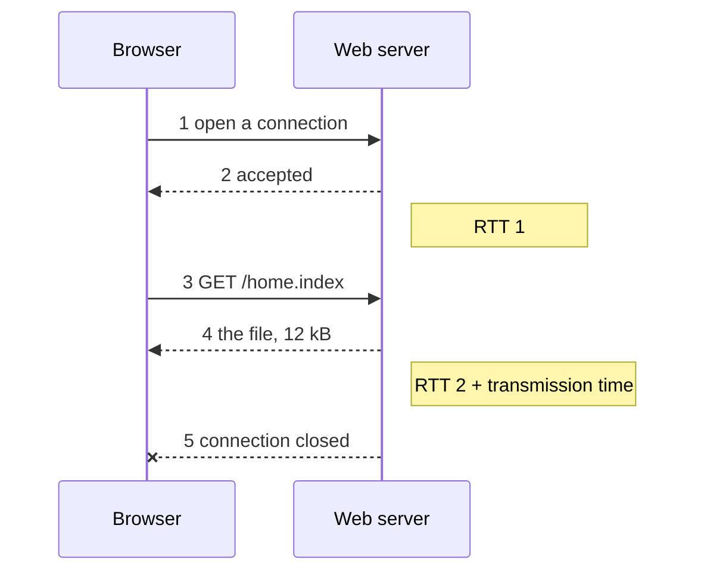

**Non-persistent HTTP** (HTTP/1.0) opens a fresh [[TCP]] connection for each object, then closes it.

**Cost per object = 2 × [[Round-Trip Time|RTT]] + transmission time**: one RTT to open the connection, one to request and receive.

*One object over a non-persistent connection (slide 23)*

The next object starts again from nothing and pays both round trips again. Compare [[Persistent HTTP]].
