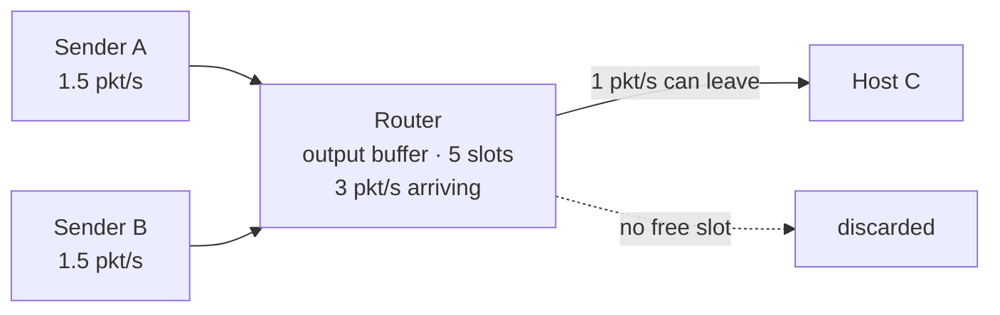

A router's output buffer has a **finite** number of slots. A queue absorbs bursts, but once arrivals outrun what the link can send, the buffer fills and further arrivals are **discarded**.

> [!note] Loss is not a malfunction
> It is simply what a finite buffer does when arrivals outrun the link. With 3 pkt/s arriving at a link that serves 1 pkt/s, the buffer sits permanently full and two thirds of arrivals are dropped.

See [[Traffic Intensity]] for the number that predicts this, and [[Queueing Delay]] for the wait that precedes it.

*Arrivals above the service rate: the buffer fills, and then arrivals are discarded. Loss is not a malfunction — it is what a finite buffer does once arrivals outrun the link.*
