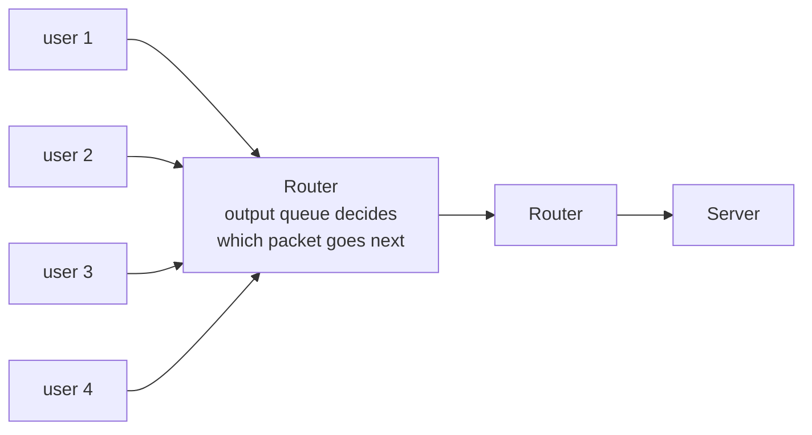

In **packet switching** there is no setup and no channels. Senders share the same links, and a **queue at each router decides which packet goes next**.

- **No setup** — the first packet leaves immediately
- You get the **full link when the queue is empty**, less when it is not
- While you are silent nothing of yours is in the queue, so **others use it all**

**The trade-off, on the same 1 Mb/s link** (each user needs 100 kb/s and is active a tenth of the time):

| | Circuit switching | Packet switching |
|---|---|---|
| Capacity | Reserved per user, in advance | Shared on demand |
| Guarantee | A predictable rate, always | None — queues absorb the bursts |
| When idle | Your reservation is wasted | Costs nothing; others use it |
| Users supported | **10** (fixed, by arithmetic) | **~35** on average |

That gap is the whole case for packet switching. The price is [[Queueing Delay]] and [[Packet Loss]]. See also [[Circuit Switching]] and [[Store-and-Forward]].

*No setup and no channels: the first packet leaves immediately, and the link runs at full rate for whichever packet is at the head of the queue. A user who goes quiet simply stops appearing in the queue — nothing was set aside, so nothing is wasted and the others get more of the link.*
