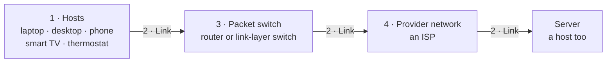

A **packet** is a chunk of a message with a **header** on the front saying where it is going. It is the unit that everything in this chapter counts, queues and delays.

> [!warning] Bytes vs bits
> File sizes and packet lengths are quoted in **bytes**; link rates are in **bits per second**. Convert before dividing — a 1,500-byte packet is $L = 1{,}500 \times 8 = 12{,}000$ bits. The missing factor of eight is the commonest lost mark in the course.

*The four kinds of piece, in the order a packet meets them. **Host is a role, not a size** — the server at the far end is one as well.*
