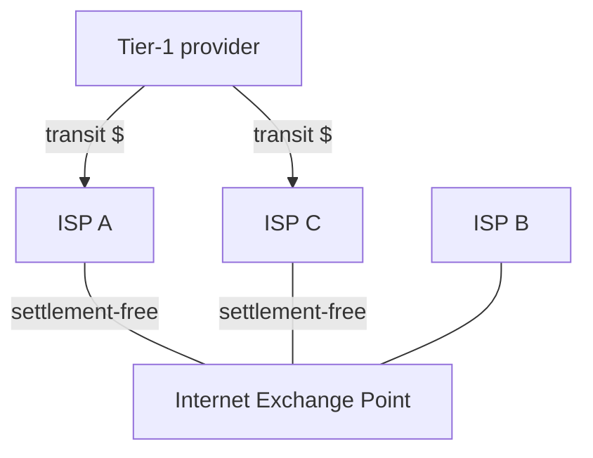

**Peering** is two networks connecting **directly, as equals**, usually **settlement-free** — neither pays the other.

Two providers in the same city can hand traffic over locally instead of paying [[Transit]] to send it hundreds of kilometers up to a tier-1 and back down.

> [!question] What a peering link actually buys
> If access ISPs X and Y both buy transit from the same tier-1 and then peer at a local [[Internet Exchange Point]]: traffic between X's customers and Y's customers stops paying transit and stops crossing the tier-1. It does **not** let them reach the rest of the Internet without the tier-1 — they still buy transit for everything else.

*Without peering, A to C goes up and over the provider — hundreds of kilometres and a per-bit charge each way. With peering it is one local hop, settlement-free. The two still need the tier-1 for everywhere else.*
