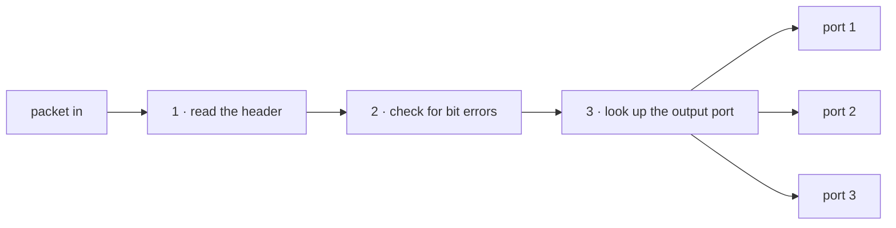

**Processing delay** $d_{proc}$ — time for the router to read the header, check the packet for bit errors, and decide which output link it belongs on. Typically **microseconds**.

- **Depends on:** router hardware, and how much work the lookup needs
- **Does NOT depend on:** packet length, or link rate — the payload is never opened

No bits move during this; it is pure decision time. The only arithmetic is the unit conversion: $20\ \mu s = 20 \times 10^{-6}\ s = 0.02$ ms.

> [!tip] Units
> $1\ s = 10^3\ \text{ms} = 10^6\ \mu s = 10^9\ \text{ns}$. Bits ÷ bits per second gives **seconds** — multiply by 1,000 for milliseconds. Do this carefully: this term gets added to three others measured in ms.

*The payload is never opened, so its length changes nothing.*
