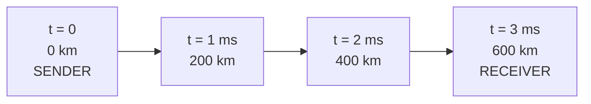

**Propagation delay** $d_{prop}$ — time for **ONE bit** to travel the length of the link once it is on the wire, at the signal speed of the medium:

$$d_{prop} = \frac{d}{s}$$

- $d$ — length of the link (meters)
- $s$ — signal speed, about $2 \times 10^8$ m/s in fiber (two-thirds light speed)

- **Depends on:** the distance and the medium
- **Does NOT depend on:** packet length or link rate — this is physics, not bandwidth

*Example:* 600 km of fiber → $\frac{6 \times 10^5}{2 \times 10^8} = 3.00$ ms. A useful rule: fiber covers **200 km per millisecond**.

> [!tip] Why CDNs exist
> A faster link does not move this term at all. Only a shorter path does — see [[Content Delivery Network]].

*One bit, four instants: it covers $d$ at speed $s$ and arrives at 3 ms. A longer packet would put more bits on this wire, but would not move this one any faster.*
