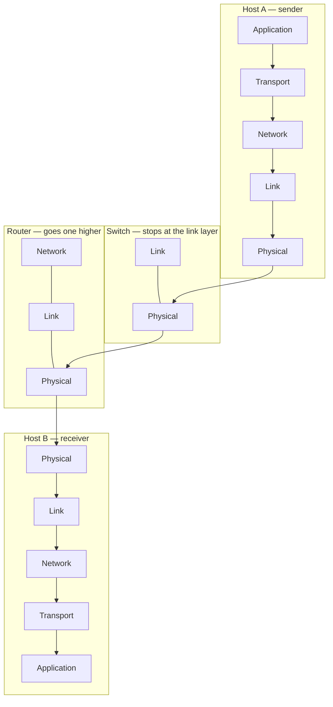

Each **layer** offers a service to the layer above it and **conceals the mechanism** by which it provides that service. This is how a system built by people who never meet stays manageable.

**The airline analogy** — down at the sender, up at the receiver:

| Layer | Departure | Arrival |
|---|---|---|
| Application | ticket: purchase | ticket: complain |
| Transport | baggage: check | baggage: claim |
| Network | gates: load | gates: unload |
| Link | runway: takeoff | runway: landing |
| Physical | airplane routing | the same in both directions |

*You buy a ticket without knowing how bags are loaded, which is exactly what "conceals the mechanism" means.*

**The five layers, with the protocols you already recognize:**

| Layer | Service it offers upward | Protocols | Unit |
|---|---|---|---|
| **Application** | Exchanges messages between two programs: request a page, send mail, resolve a name | HTTP, SMTP, DNS | message |
| **Transport** | Delivers to the right process on the host: in order and without loss (TCP), or fast and unchecked (UDP) | TCP, UDP | segment |
| **Network** | Moves a datagram from any host to any other, across whatever networks lie between | IP, routing protocols | datagram |
| **Link** | Carries a frame across one link, to the next device only | Ethernet, Wi-Fi | frame |
| **Physical** | Puts individual bits onto copper, fiber or radio | — | bits |

**How far up each device goes:**

| Device | Reads up to |
|---|---|
| [[Host]] | All five |
| [[Switch]] | Link |
| [[Router]] | Network |

> [!tip] The end-to-end principle
> Nothing in the middle opens the transport header. That is why the Internet could scale, and why the layers above the link can be replaced without touching a switch.

*Thirteen positions for one packet: down Host A's five layers, through a switch that stops at the link layer and a router that goes one higher, and back up Host B's — where the application receives `M`, byte for byte what was sent.*
