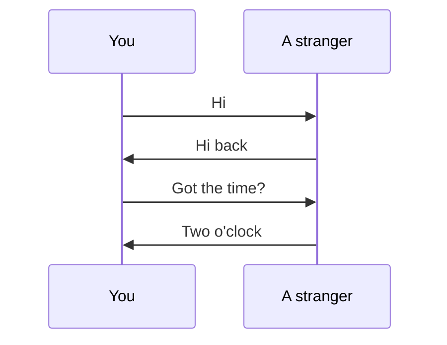
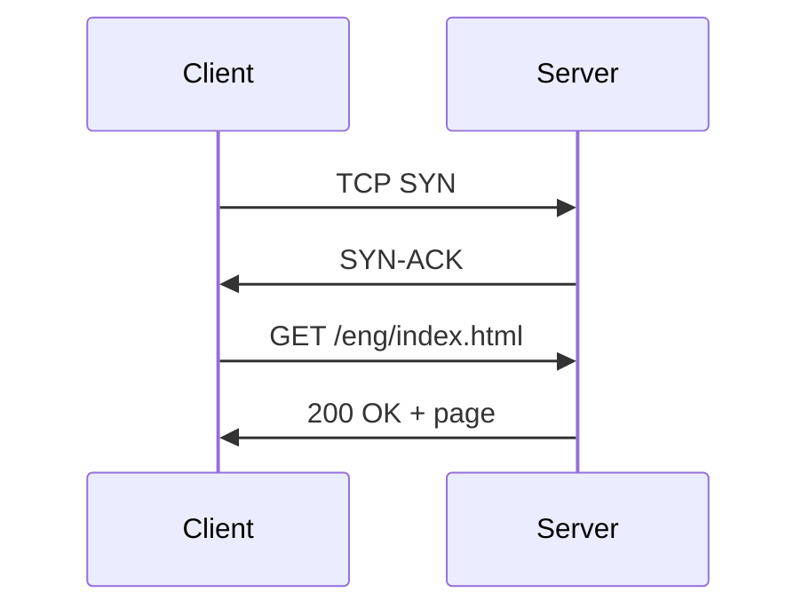

A **protocol** defines the **format** and the **order** of messages exchanged between two or more communicating parties, and the **actions** taken when a message is sent or received.

**You already follow protocols.** Human conversation fixes the format of what is said, the order it is said in, and the actions a remark obliges:

*Open the channel · acknowledge it · make the request · answer it. Read across a rung and the machine version below is doing the same job; read down either side and the order is fixed.*

**Format — every boundary is fixed by the standard:**

| `GET` | `/eng/index.html` | `HTTP/1.1` | `\r\n` |
|---|---|---|---|
| METHOD — what to do | TARGET — to what | VERSION — by which rules | TERMINATOR |

*A receiver that divided the same bytes differently would read different fields, so the division must be agreed before any message is sent.*

**Order — the request is third, and that is not incidental:**

*A server that receives the request first has nothing to attach it to, and discards it unread.*

**Actions** — parse the bytes on the boundaries above, resolve what the target names on this host, reply 200 with the resource or 404 if it does not exist.

> [!warning] Interpreting a message is not enough
> The response the standard requires is itself part of the protocol — a server that parses a request correctly and then does nothing has violated it.

> [!question] Break one rule
> The same four messages are each individually valid. Switch off any single agreement and the exchange fails in its own particular way: no agreed **format** and the fields land in the wrong places; no agreed **order** and the request arrives with nothing to attach it to; no agreed **actions** and a perfectly parsed request gets no reply.
