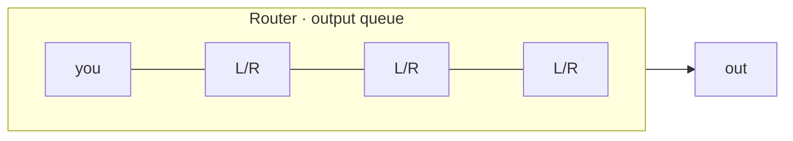

**Queueing delay** $d_{queue}$ — time your packet waits in the output buffer while the packets that arrived before it are transmitted.

$$d_{queue} = N \times \frac{L}{R}$$

- $N$ — packets already queued ahead of yours
- $L$ — packet length (bits), $R$ — link rate (bits/s)

- **Depends on:** how busy the link already is when your packet arrives (what sets $N$ is [[Traffic Intensity]])
- **Does NOT depend on:** anything about your own packet

*Example:* joining a 10 Mb/s queue behind three 1,500-byte packets — the link must finish all three first, so $3 \times \frac{12{,}000}{10^7} = 3 \times 1.20 = 3.60$ ms.

> [!note] The only one that moves
> Of the four delays this is the only one that changes packet by packet, and the only one that can grow without limit — up to the buffer's size, after which you get [[Packet Loss]] instead.

*Three ahead, each costing a full $L/R$, so your wait is $3 \times L/R$. How many are ahead is set by how busy the link already is — nothing about your own packet enters into it.*
