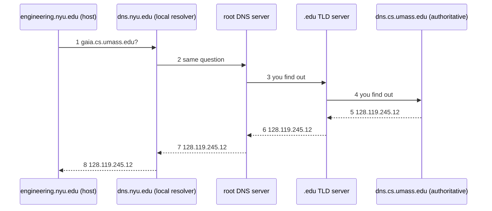

In a **recursive query**, each server asks the next one on the asker's behalf, and the answer comes back down the same chain. Same five machines, same eight messages as an [[Iterated DNS Query]]; only who does the work changes. The **root** ends up doing the most work, which is why iterated is what's used.

*Recursive resolution of gaia.cs.umass.edu (slide 48)*

