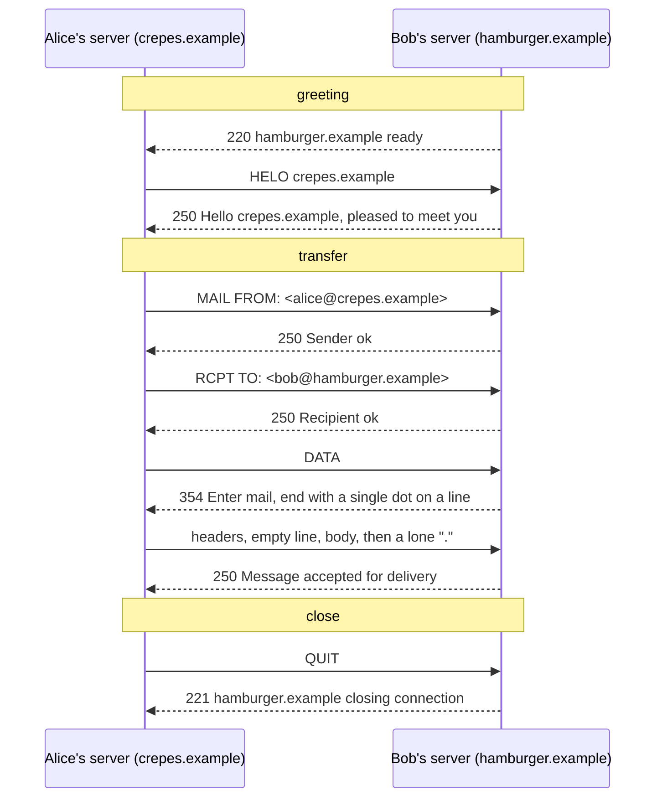

**SMTP** (Simple Mail Transfer Protocol, 1982) transfers a message from the sending mail server to the receiving one, over a reliable [[TCP]] connection on **port 25**, in three phases: **greeting, transfer, close**.

- **Push, not pull:** [[HTTP]] is a client asking for something it wants; SMTP is a client delivering something the other end didn't ask for.
- **7-bit text** historically, so binary attachments (images, accented chars) are encoded into printable characters, which is why an attachment is bigger than its file.
- Reply codes work like [[HTTP Status Codes]].

*A real SMTP session (slides 61–62)*

- The **receiver speaks first**, the opposite of the Web.
- `MAIL FROM` is the envelope sender (where bounces go); `RCPT TO` is the envelope recipient, one line per recipient. See [[SMTP Envelope]].
- A single `.` alone on a line ends the message, so a user's own lone dot has to be escaped.
- After `250 accepted`, the receiver owns the message and must deliver it.

**SMTP vs HTTP**

| | HTTP | SMTP |
|---|---|---|
| Who initiates | the machine that **wants** the object (pull) | the machine that **has** the message (push) |
| Connection | persistent, reused for many objects | persistent, many messages to the same server |
| Objects per exchange | one per request/response | one message with many parts in a single body |
| Data ends up | in a program someone is watching | on a disk, waiting for someone who's not there |

Both are text, command/response, with numeric codes.
