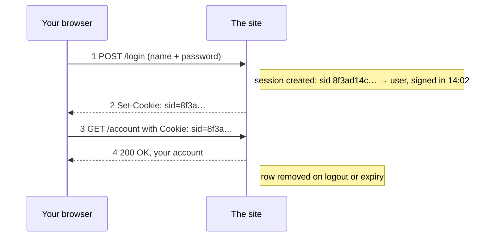

A **session** is a sequence of related requests treated as one visit by one user, together with the state the server keeps for it and a lifetime after which that state is discarded. The [[Cookie]] is the identifier; the session is the state it stands for.

- The password crosses **once**, at login. After that, **the cookie is the credential**: whoever holds it is you until the session ends (hence [[Cookie Security Flags]]).

*Logging in creates a session (slide 36)*

**Where the state lives:**

| | Server-side table | Signed token in the cookie |
|---|---|---|
| Cookie holds | a long random key only | the state + a signature nobody can forge |
| Buys | logout = delete one row; user never sees the state | any server verifies alone; nothing stored, so statelessness survives |
| Costs | server remembers again; every machine must reach the table | early logout is hard: token valid until it expires |
