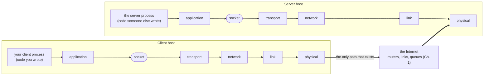

A **socket** is the interface (API) between an application [[Process]] and the transport layer beneath it. The process writes messages into its socket and reads arriving ones out; everything past the socket is the operating system's problem.

- Above the socket you decide everything; below it you choose exactly one thing: which transport protocol ([[TCP]] or [[UDP]]).
- A socket is identified by an IP address + a [[Port Number]].

*Where the socket sits between two processes (slide 7)*

