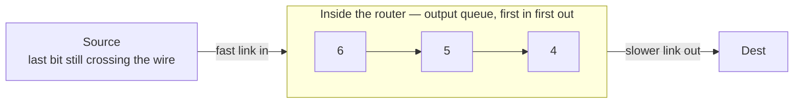

**Store-and-forward**: a packet switch may not transmit the first bit of a packet until the **last bit has arrived**.

**Sent is not received.** The source is finished the moment its last bit goes onto the wire; the packet is not *received* until that same bit lands at the other end. Only then may the router forward it, and what it stores it stores in order — first in, first out.

Consequence for arithmetic: **every hop pays a full [[Transmission Delay]]**. A packet crossing three links is transmitted three times.

*It may not send the first bit until the last bit has arrived, so every hop pays for the whole packet.*
