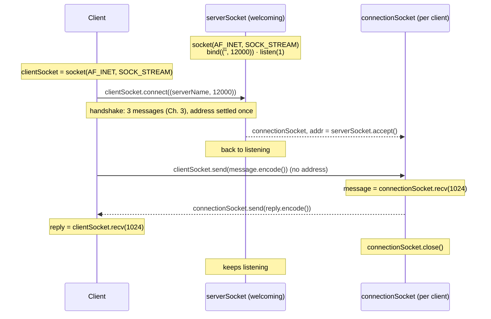

With a [[TCP]] socket a connection must exist before any data moves. The server keeps a **welcoming socket** that only accepts connections, and `accept()` creates a **second, dedicated socket** per client.

*TCP client and server, end to end (slide 91)*



```python
# CLIENT
from socket import *
serverName = 'servername'
serverPort = 12000
clientSocket = socket(AF_INET, SOCK_STREAM)        # SOCK_STREAM this time
clientSocket.connect((serverName, serverPort))     # handshake: the only place the address appears
sentence = input('Input lowercase sentence: ')
clientSocket.send(sentence.encode())
reply = clientSocket.recv(1024)
print('From server:', reply.decode())
clientSocket.close()
```

```python
# SERVER
from socket import *
serverPort = 12000
serverSocket = socket(AF_INET, SOCK_STREAM)
serverSocket.bind(('', serverPort))
serverSocket.listen(1)                             # the welcoming socket only listens
print('ready to receive')
while True:
    connectionSocket, addr = serverSocket.accept() # a SECOND socket, for this client
    sentence = connectionSocket.recv(1024).decode()
    connectionSocket.send(sentence.upper().encode())
    connectionSocket.close()                       # closes THIS conversation, not the server
```

| | [[UDP Socket Programming\|UDP]] | TCP |
|---|---|---|
| Setup | none | `connect` + `accept` finish before data |
| Server sockets | one, serves everybody | welcoming socket + one per client |
| Destination address | on every message | once, inside `connect` |
