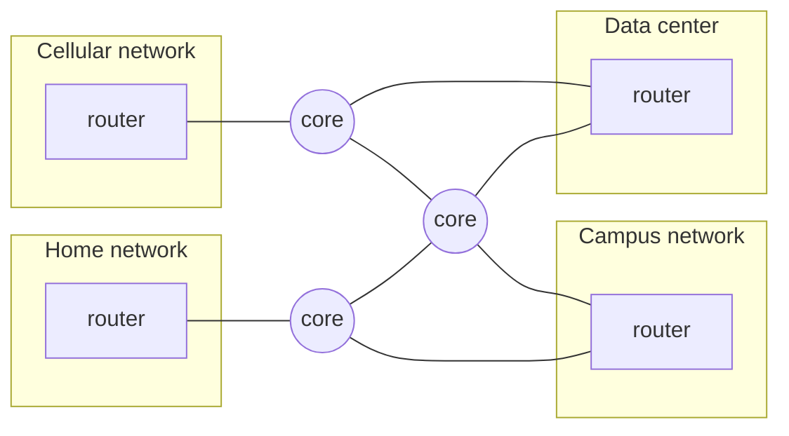
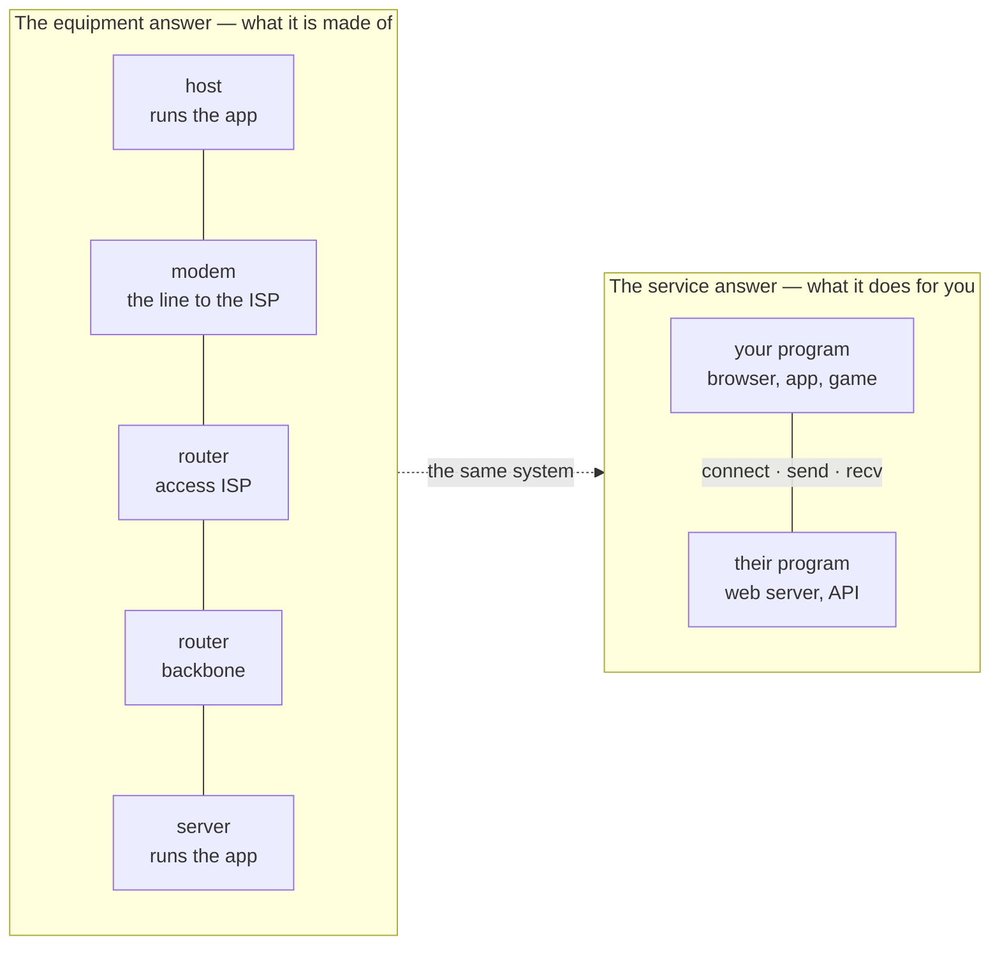

**The Internet** is a *network of networks*: many independently built and separately owned [[Network]]s, each connecting its own devices, joined at their boundaries by [[Router]]s, so that a device on any one of them can exchange data with a device on any other.

Four networks, four owners, none designed with the others in mind. Each puts one router on its boundary and those routers agree to carry each other's traffic — nothing inside any of them changes.

*That, and nothing else, is what makes it the Internet.*

**More than one route.** A phone on the home network requesting a page from a server in the data center has several paths available to it. Same sender, same receiver, same message, two different paths: nothing in the message names a route, and no single network chose it.

**Two ways to describe the same system:**

| | The equipment answer | The service answer |
|---|---|---|
| Question | What the Internet is **made of** | What the Internet **does for you** |
| Contents | Hosts, links, packet switches, providers, and the TCP/IP rules that make them interoperate | An infrastructure two programs build on: connect · send · recv |
| Who lives here | Engineers — most of this course | Applications: the web, email, streaming, video calls |

*Engineers work on the top; the applications that made the Internet worth building only ever see the bottom, and they only work because the top keeps its promise. TCP/IP is the set of rules every box in the top row shares.*
