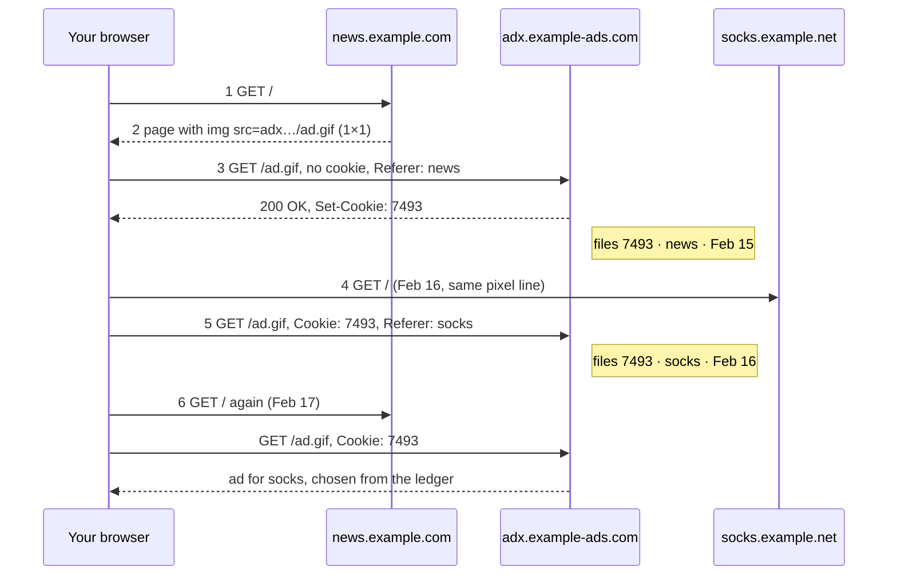

A **third-party cookie** is set by a server other than the site you're visiting, via an object that page references (often an invisible 1×1 pixel). It lets one ad network recognize you across every site that embeds it.

Two ordinary facts combine: a page may name objects on other servers, and fetching one is a request to that server, carrying *its own* cookie plus a `Referer` saying which page you were on.

*Tracking across sites with one pixel (slide 38)*

**First party** = the site in your address bar. **Third party** = a server you never asked for anything.

> [!note] Legal side (since 2018)
> An identifier that singles a person out is **personal data** even without a name. Collecting it needs consent, and the site must work if refused. That's the cookie banner: "necessary" = first-party; "advertising" = third-party.
