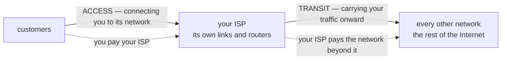
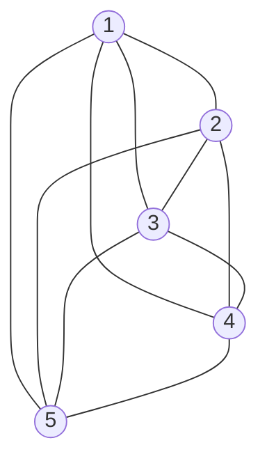

**Transit** is the paid service of carrying a customer's traffic onward to networks the provider does not own. It is charged per bit.

*Access is the connection; transit is the onward carriage. Every ISP therefore stands in one of three relationships to any other — **customer**, **supplier** or **[[Peering|peer]]**.*

**Why not a full mesh instead?** Connecting every network to every other cannot scale: $N$ networks need $\dfrac{N(N-1)}{2}$ links.

*Five networks already need ten links, and every new one has to reach every existing one. A thousand networks would need half a million — nobody builds that and nobody could pay for it, so the hierarchy of [[Internet Service Provider|ISPs]] exists instead, with [[Peering]] as the local shortcut.*
