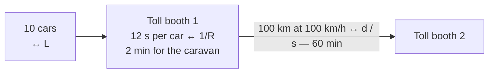

**Transmission delay** $d_{trans}$ — how long the sender's interface is busy **pushing the packet onto the link**. It emits $R$ bits every second, so $L$ bits take:

$$d_{trans} = \frac{L}{R}$$

First bit out to last bit out.

- **Depends on:** how much there is to send ($L$) and how fast the interface sends it ($R$)
- **Does NOT depend on:** distance — the sender is finished the moment the last bit is out

*Example:* a 1,500-byte packet onto a 10 Mb/s link → $\frac{12{,}000}{10^7} = 1.20$ ms.

Transmission **fills** the link; [[Propagation Delay|propagation]] **crosses** it. The two are independent: double the packet and only transmission moves; move the receiver and only propagation moves.

*Transmission **fills** the link; [[Propagation Delay|propagation]] **crosses** it, and the two are independent. Double the packet and only transmission moves; move the receiver and only propagation moves.*

> [!tip] The caravan analogy
> Cars through a toll booth = bits onto a link. Booth service time per car ↔ $1/R$ · number of cars ↔ $L$ · road length ↔ $d$ · car speed ↔ $s$. Ten cars at 12 s each = **2 min at the booth**; 100 km at 100 km/h = **60 min on the road**. The road being 30× the booth is the usual case on a long, fast link.

*62 min for the hop, of which the road is 30× the booth — the usual case on a long, fast link. Widen the booth and you save minutes; only a shorter road saves the hour.*
