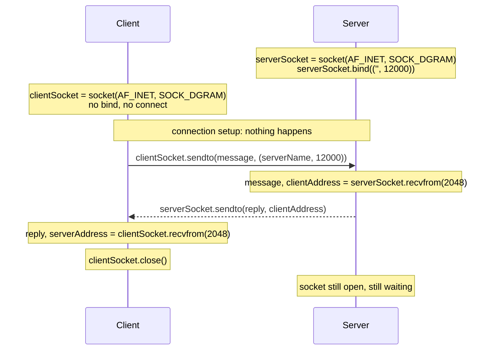

With a [[UDP]] socket there's no connection to open or close: the server binds a port and waits, the client just sends, and **every datagram carries its own destination**.

*UDP client and server, end to end (slide 88)*



```python
# CLIENT
from socket import *
serverName = 'hostname'
serverPort = 12000
clientSocket = socket(AF_INET, SOCK_DGRAM)     # SOCK_DGRAM is the whole choice
message = input('Input lowercase sentence: ')
clientSocket.sendto(message.encode(), (serverName, serverPort))  # destination on every message
reply, serverAddress = clientSocket.recvfrom(2048)
print(reply.decode())
clientSocket.close()
```

```python
# SERVER
from socket import *
serverPort = 12000
serverSocket = socket(AF_INET, SOCK_DGRAM)
serverSocket.bind(('', serverPort))            # claim the port
print('ready to receive')
while True:
    message, clientAddress = serverSocket.recvfrom(2048)   # address comes WITH the data
    serverSocket.sendto(message.decode().upper().encode(), clientAddress)
```

> [!warning] Keep the second half of `recvfrom`
> It returns `(data, sender address)`. Discard the address and the server has no way to reply: the commonest way this server fails.

Differences from [[TCP Socket Programming]]: no setup step · **one** server socket for every client · destination written on **every** message.
