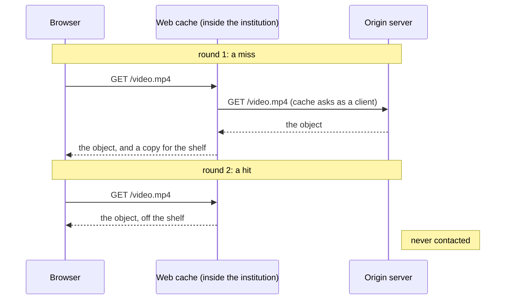

A **web cache** (also **proxy server**) answers requests on behalf of an origin server. It is a **server to the client** that asked, and a **client to the origin** on a miss. It sits between a population (office, campus, ISP) and the Internet, remembering what it fetched.

*Miss then hit (slide 71)*

- **Caches stack**: neither end can tell, so browser cache → institution's → provider's.
- Three parties gain: user (object from inside the building), institution (less traffic on its paid link), content provider (delivery it doesn't pay for).

**What a cache is worth** (15 req/s, 100 kbit objects = 1.50 Mb/s demand, 2 s RTT to origin):

Utilization of the access link (the [[Traffic Intensity]] of the misses): $\rho = \dfrac{(1-h)\,\lambda L}{R}$

| Option | Link utilization | Avg time |
|---|---|---|
| Do nothing (1.54 Mb/s) | 97% | ~4.5 s, unstable |
| Buy a bigger link (154 Mb/s) | 0.97% | 2.00 s, billed monthly; the 2 s to origin is the floor |
| Install a cache, h = 40% (1.54 Mb/s) | 58% | 1.30 s, one machine bought once |

Keeping cached copies honest: [[Conditional GET]].
