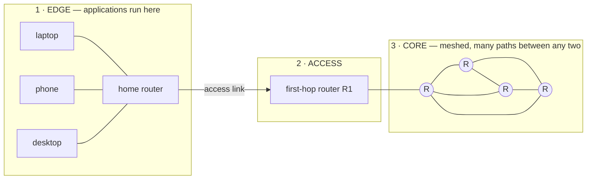
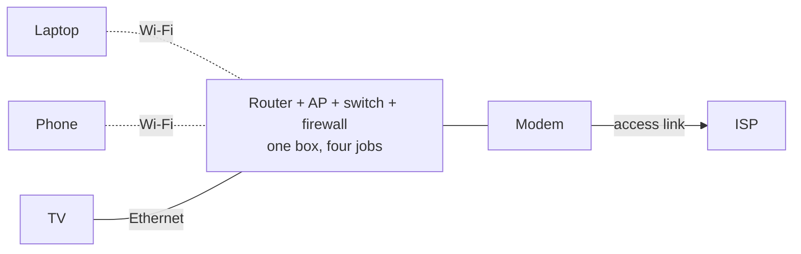
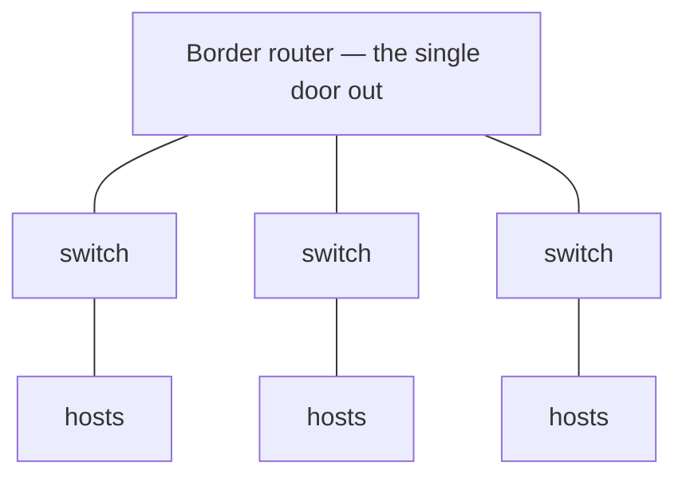
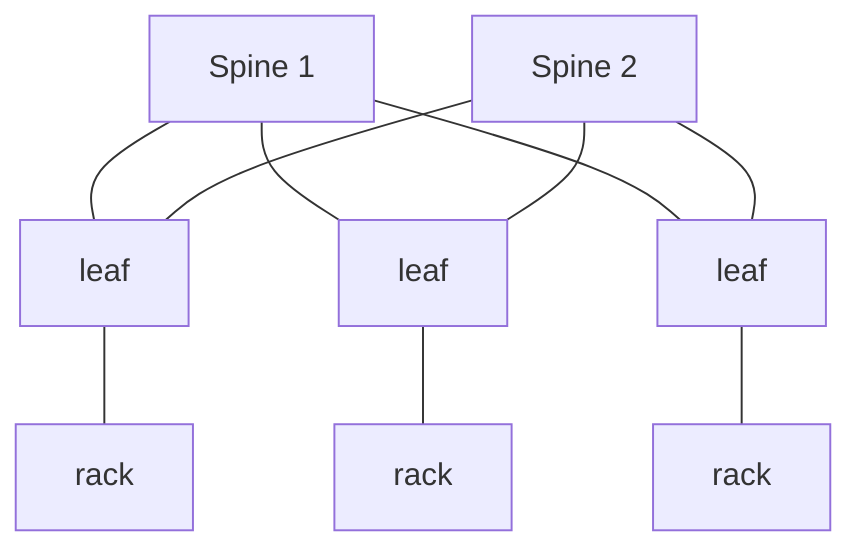
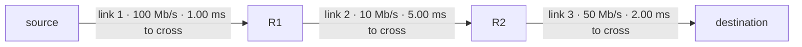
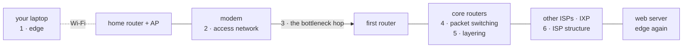

# Chapter 1 — Computer Networks and the Internet

> [!info]- Slide index — where each section comes from
> | Section of this note | Slides in the deck |
> |---|---|
> | *Intro and hour table* | 2 What you will be able to do · 3 Where this chapter goes |
> | **01 · The Internet** | 4 *part divider* |
> | ⤷ `Network` | 5 What is a network? |
> | ⤷ `The Internet` | 6 The Internet is built from four kinds of piece · 7 Networks are built independently · 8 Connect them, and you have the Internet · 9 One message, four networks, more than one route · 10 The same Internet, described two ways |
> | ⤷ `Packet` | 6 The Internet is built from four kinds of piece |
> | ⤷ `Client and Server` | 11 The same host is client and server |
> | ⤷ `Protocol` | 12 You already follow protocols · 13 What is a protocol? · 14 Try it: break one rule |
> | ⤷ Three regions of one network | 15 Three regions of one single network · 19 Edge and core: which devices live where · 20 An access network reaches your first router · 21 Access capacity is either shared or dedicated · 22 Dial-up: the access link you could hear |
> | **02 · Network Edge** | 17 *part divider* |
> | ⤷ Device table and device notes | 18 The devices a network is built from |
> | ⤷ Physical media | 25 Wired and wireless: the link types you will meet |
> | ⤷ How real networks stack these | 23 A home network stacks several technologies · 24 Enterprise and data centers scale the same ideas |
> | **03 · Network Core** | 28 *part divider* |
> | ⤷ `Forwarding` / `Routing` | 29 Forwarding is local; routing is global |
> | ⤷ `Store-and-Forward` | 30 Store-and-forward: the whole packet, then forward |
> | ⤷ `Packet Loss` | 31 Queues absorb bursts, until the buffer fills |
> | ⤷ Sharing one link | 32 How do several users share one link? · 33 FDM and TDM: watch four users share one wire · 34 Reserving a path, or sharing one · 35 The trade-off, side by side |
> | **04 · ISPs and Internet Structure** | 36 *part divider* |
> | ⤷ `Internet Service Provider` / `Transit` | 37 An ISP sells two things: access and transit · 38 Connecting every ISP to every other cannot scale · 39 The Internet's structure is a hierarchy of ISPs |
> | ⤷ `Peering` / `Internet Exchange Point` | 40 Peering lets networks connect directly |
> | ⤷ `Content Delivery Network` | 41 Why does content move closer to you? · 42 Content providers now build their own networks |
> | **05 · Delay at a Single Hop** | 45 *part divider* |
> | ⤷ `Nodal Delay` | 46 Where does the time go on one hop? · 47 Four delays at every output port |
> | ⤷ `Processing Delay` | 48 Processing delay |
> | ⤷ `Queueing Delay` | 49 Queueing delay |
> | ⤷ `Transmission Delay` | 50 Transmission delay · 52 Transmission fills the link; propagation crosses it · 53 The caravan analogy makes the two delays physical |
> | ⤷ `Propagation Delay` | 51 Propagation delay · 52 Transmission fills the link; propagation crosses it |
> | **06 · End-to-End Delay and Throughput** | 55 *part divider* |
> | ⤷ `Traffic Intensity` | 59 How busy is the link? Traffic intensity |
> | ⤷ `Throughput` | 60 What is throughput? |
> | ⤷ `Bottleneck Link` | 61 Throughput is set by the bottleneck link |
> | ⤷ Worked example — London → Thunder Bay | 56 Worked example: reading the numbers out of the problem |
> | ⤷ Worked example — one hop | 57 Worked example: all four delays at one hop |
> | ⤷ Worked example — three links | 58 Worked example: end-to-end delay across three links |
> | ⤷ Worked example — download time | 62 Worked example: how long does a download take? |
> | **07 · Protocol Layers** | 63 *part divider* |
> | ⤷ `Protocol Layering` | 64 Layering keeps a huge system manageable · 65 Five layers divide the job of communication · 68 Routers and switches read only the headers they need |
> | ⤷ `Encapsulation` | 66 Encapsulation: a message inside a message · 67 The same idea, header by header · 69 One message, wrapped and unwrapped |
> | **Narrating one web request** | 71 One request, and now you can narrate the journey |
> | **Practice questions** | 16 · 26 · 43 · 44 · 70 · 72 — the six *Check yourself* slides |
> | **Notes to Self** | 14 · 30 · 59 · 61 *interactives* · 73 Do you have any questions? |

Seven parts across three teaching hours. The order is not arbitrary: you cannot put a number on a delay until you know what a packet switch does with a packet.

| Hour | Parts | Focus |
|---|---|---|
| 1 | 01–02 | What the Internet is, and what is at its edge |
| 2 | 03–05 | The core, who owns it, and where the time goes |
| 3 | 06–07 | End-to-end performance, and how the Internet is organized |

Five of the six learning outcomes ask you to **account for** something in words; exactly one asks you to produce a number.

## 01 · The Internet

![[Network]]

![[The Internet]]

![[Packet]]

![[Client and Server]]

![[Protocol]]

### Three regions of one network

![[Network Edge]]

![[Access Network]]

![[Network Core]]

*The map for the rest of the chapter: applications run at the edge, a single access link reaches the first router you do not own, and the core forwards packets between those routers.*

## 02 · Network Edge

The dividing question for every device: **does it forward traffic for others, and if so, using which address?**

| Device | Forwards on |
|---|---|
| [[Host]] / Server | none |
| [[Switch]] | MAC |
| [[Router]] | IP |
| [[Access Point]] | MAC |
| [[Modem]] | none |
| [[Firewall]] | policy |

![[Host]]

![[Switch]]

![[Router]]

![[Access Point]]

![[Modem]]

![[Firewall]]

![[MAC Address]]

![[IP Address]]

### Physical media

![[Physical Media]]

### How real networks stack these

- **Home:** one consumer box does four jobs at once — switch, access point, router and NAT firewall — with a [[Modem]] behind it on the access link
- **Enterprise:** a tree of switches under **one border router**. Scale: 3 switches · ~12 hosts · 1 Gb/s, with a single path between any two hosts. One path out; if the border router fails, the site is offline. Traffic is mostly in-and-out, so one door is enough
- **Data center:** a **mesh**, not a tree. Scale: 3 racks · ~24 servers · 10 Gb/s uplinks, with two paths between any two racks (one per spine). Every leaf wires to every spine, so any two racks have disjoint paths. Traffic is mostly server-to-server; the duplicate paths are bought for **capacity first** and survive failures as a side effect. Lose a spine and capacity halves — nothing goes dark

*The home arrangement — a single consumer device performing four distinct functions at once.*

*Enterprise: a tree. One path between any two hosts, and if the border router fails the site is offline.*

*Data center: a mesh. Two paths between any two racks, one per spine — lose a spine and capacity halves, nothing goes dark.*

## 03 · Network Core

![[Forwarding]]

![[Routing]]

![[Store-and-Forward]]

![[Packet Loss]]

### Sharing one link

![[Frequency-Division Multiplexing]]

![[Time-Division Multiplexing]]

![[Circuit Switching]]

![[Packet Switching]]

## 04 · ISPs and Internet Structure

![[Internet Service Provider]]

![[Transit]]

![[Peering]]

![[Internet Exchange Point]]

![[Content Delivery Network]]

## 05 · Delay at a Single Hop

![[Nodal Delay]]

![[Processing Delay]]

![[Queueing Delay]]

![[Transmission Delay]]

![[Propagation Delay]]

## 06 · End-to-End Delay and Throughput

![[Traffic Intensity]]

![[Throughput]]

![[Bottleneck Link]]

### Worked example — London → Thunder Bay

1,500-byte packet · 100 Mb/s · 1,000 km fiber · $s = 2\times10^8$ m/s · idle link.

$d_{trans} = \frac{12{,}000}{10^8} = 0.12$ ms · $d_{prop} = \frac{10^6}{2\times10^8} = 5.00$ ms · **one-way = 5.12 ms**.

Propagation is **42×** the transmission term. Swap in a 1 Gb/s link and only $d_{trans}$ moves (0.012 ms), taking the total to 5.01 ms — a tenfold faster link buys back **2%**. On a long, fast path you are paying for distance, and nothing purchases a change to the speed of light.

### Worked example — one hop, all four delays

1,500-byte packet · 10 Mb/s link · 600 km · 3 packets queued · 20 µs processing.

| Term | Working | Value |
|---|---|---|
| $d_{proc}$ | stated in the problem | 0.02 ms |
| $d_{queue}$ | $3 \times \frac{12{,}000}{10^7}$ | 3.60 ms |
| $d_{trans}$ | $\frac{12{,}000}{10^7}$ | 1.20 ms |
| $d_{prop}$ | $\frac{6 \times 10^5}{2 \times 10^8}$ | 3.00 ms |
| **$d_{nodal}$** | | **7.82 ms** |

Queueing is the largest single term and the only one that changes with load.

### Worked example — three links

Same 1,500-byte packet ($L = 12{,}000$ bits), every link idle. It is transmitted **once per link**, because every router holds it in full before forwarding.

| Link | Rate | $d_{trans}$ | $d_{prop}$ |
|---|---|---|---|
| source → R1 | 100 Mb/s | 0.12 ms | 1.00 ms |
| R1 → R2 | 10 Mb/s | 1.20 ms | 5.00 ms |
| R2 → dest | 50 Mb/s | 0.24 ms | 2.00 ms |
| **Totals** | | **1.56 ms** | **8.00 ms** |

$d_{\text{end-to-end}} = 1.56 + 8.00 =$ **9.56 ms**.

### Worked example — download time

4 MB file · server uploads at 2 Mb/s · your access link 1 Mb/s · core hundreds of Mb/s (ignore it).

$F = 4\times10^6 \times 8 = 32\times10^6$ bits · throughput $= \min\{2, 1\} = 1$ Mb/s · $T = \frac{32\times10^6}{1\times10^6} =$ **32 s**.

Doubling the *server's* link changes nothing — the minimum is unchanged. Doubling *your* access link halves it to 16 s.

## 07 · Protocol Layers

![[Protocol Layering]]

![[Encapsulation]]

## Narrating one web request

Loading `www.example.com`, in the order the ideas appear:

1. **Hosts at the edge** — your laptop runs the application; nothing in the middle does
2. **Access networks** — Wi-Fi, then cable or fiber, to the first router (the bottleneck hop)
3. **Delay and throughput** — every hop costs time; the narrowest link sets the rate
4. **Packet switching** — each router stores the whole packet, looks it up, forwards it out one link
5. **Layering** — wrapped going down, unwrapped in exactly reverse order at the far end
6. **ISP structure** — an access ISP buys reach from a regional ISP, which buys from a tier-1, or hands traffic over directly at an exchange

## Practice questions

- **Laptop + printer on one Ethernet cable, speaking IP, nothing else attached.** → A network, but **not** part of the Internet: devices, link and rules are all present, but the Internet is a network *of* networks and nothing joins this one to any other.
- **Host A sends to B on the same home network, then to a server in Toronto — both leave via the same box.** → The **switch** handles the first (MAC lookup, nothing above the link layer consulted); the **router** handles the second (IP lookup, choice of next hop).
- **X and Y both buy transit from the same tier-1, then peer at a local IXP.** → Traffic between X's and Y's customers stops paying transit and stops crossing the tier-1. They still need the tier-1 for everywhere else.
- **1 Mb/s link, TDM, 100 kb/s slots, users active 10% of the time.** → **10 users**, link carrying data ~**10%** of the time. The division is fixed at setup and nobody may touch an idle slot.
- **A frame reaches a link-layer switch. Which headers does it read?** → The **link header only**; network, transport and application headers are payload it never opens.
- **1,000-byte packet · 400 km · 2 Mb/s · 2 packets queued · negligible processing.** → $L = 8{,}000$ bits, $L/R = 4$ ms. $d_{queue} = 8$, $d_{trans} = 4$, $d_{prop} = \frac{4\times10^5}{2\times10^8} = 2$. **Total 14 ms.**

## Notes to Self

- Chapter 2 starts at the top of the stack: the application layer
- The slide deck has live interactives worth revisiting — the store-and-forward animation, the traffic-intensity slider, and the bottleneck simulator

**The six learning outcomes:**

| # | Verb | Outcome | Part |
|---|---|---|---|
| 1 | Describe | what the Internet is made of, and what it does for the programs running on it | 1 |
| 2 | Identify | hosts, access networks, and the physical media that connect them | 2 |
| 3 | Explain | packet switching, store-and-forward, and how a queue forms | 3 |
| 4 | Explain | why the Internet is a hierarchy of separately owned, interconnected networks | 4 |
| 5 | Compute | the four delays, traffic intensity, and end-to-end throughput | 5 |
| 6 | Explain | layering and encapsulation as the way a huge system stays manageable | 7 |
