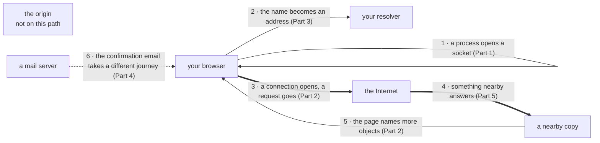

# Chapter 2 — The Application Layer

> [!info]- Slide index — where each section comes from
> | Section of this note | Slides in the deck |
> |---|---|
> | *Intro and hour table* | 2 Learning outcomes · 3 The structure of this chapter |
> | **01 · Application Principles** | 4 *part divider* |
> | ⤷ `Process` | 5 Application code runs only at the edge · 6 The process is what communicates |
> | ⤷ `Socket` | 7 The socket: where a process meets the network 📊 · 87 The socket API, revisited |
> | ⤷ `Port Number` | 8 Addressing a process, not a host |
> | ⤷ `Application-Layer Protocol` | 9 What an application-layer protocol has to settle |
> | ⤷ `Transport Service Requirements` | 10 What an application may ask of the network · 11 What representative applications require |
> | ⤷ `TCP` / `UDP` | 12 The two transport services an application may choose · 13 Why an application would choose UDP · 14 Which transport protocol each application uses |
> | ⤷ `TLS` | 15 Neither transport protocol provides confidentiality |
> | **02 · The Web and HTTP** | 18 *part divider* |
> | ⤷ `HTTP` | 19 A web page is not a file · 21 HTTP: the protocol that carries the Web 📊 |
> | ⤷ `URL (Networking)` | 20 Every object has an address |
> | ⤷ `Round-Trip Time` | 22 The round trip and what it costs |
> | ⤷ `Non-Persistent HTTP` | 23 Non-persistent HTTP: one connection per object 📊 |
> | ⤷ `Persistent HTTP` | 24 Persistent HTTP: keep the connection open · 25 How long a page takes to load |
> | ⤷ `HTTP 2 and HTTP 3` | 26 HTTP/2 and HTTP/3: what the Web runs today |
> | ⤷ `HTTP Request Message` | 27 The request, byte by byte · 28 The general form of a request · 32 Requesting a page by hand |
> | ⤷ `HTTP Methods` | 29 Four methods in common use |
> | ⤷ `HTTP Response Message` | 30 The response, byte by byte |
> | ⤷ `HTTP Status Codes` | 31 HTTP status codes: what the three digits mean |
> | ⤷ `Cookie` | 34 The problem with a stateless protocol · 35 Cookies: state carried in the messages 📊 |
> | ⤷ `Session` | 36 Sessions: what the number stands for 📊 · 37 Where the session state lives |
> | ⤷ `Third-Party Cookie` | 38 The same mechanism, used across sites 📊 · 40 Who owns the data a cookie carries |
> | ⤷ `Cookie Security Flags` | 39 The cookie flags that protect a session |
> | **03 · Names and DNS** | 43 *part divider* |
> | ⤷ `IP Address` *(Ch. 1 note, extended)* | 44 Every message is addressed to a number |
> | ⤷ `DNS` | 45 Two kinds of name for the same host · 46 Why a single database would not have worked · 51 One lookup, four distinct purposes |
> | ⤷ `DNS Hierarchy` | 46 Why a single database would not have worked 📊 |
> | ⤷ `Iterated DNS Query` | 47 Iterated queries: the resolver does the work 📊 |
> | ⤷ `Recursive DNS Query` | 48 Recursive queries: the burden passes upward 📊 |
> | ⤷ `DNS Caching` | 49 Caching keeps most queries away from the root · 54 Registering a name of your own |
> | ⤷ `DNS Resource Record` | 52 DNS records: what one actually looks like · 54 Registering a name of your own |
> | ⤷ `DNS Message Format` | 53 The query and the reply are one format |
> | ⤷ `DNS Security` | 55 DNS security: attacking the directory |
> | **04 · Email** | 58 *part divider* |
> | ⤷ `Mail Server` | 59 The three components of a mail system · 60 One message, three hops 📊 |
> | ⤷ `SMTP` | 61 SMTP: a push protocol 📊 · 62 SMTP: a real conversation between two servers 📊 · 65 SMTP and HTTP compared |
> | ⤷ `SMTP Envelope` | 63 The envelope is not the message |
> | ⤷ `IMAP` / `POP` | 64 IMAP and POP: getting it out of the mailbox |
> | **05 · Content at Scale** | 69 *part divider* |
> | ⤷ Three answers to scale | 70 Serving at scale: one server, a million people |
> | ⤷ `Web Cache` | 71 First answer: a web cache near the users 📊 · 72 What a cache is worth, measured |
> | ⤷ `Conditional GET` | 73 Conditional GET: keeping a cached copy honest |
> | ⤷ `Peer-to-Peer Architecture` | 74 Second answer: peers that upload as well as download |
> | ⤷ `File Distribution Time` | 75 How long distribution to every peer takes |
> | ⤷ `BitTorrent` | 76 BitTorrent: a file, cut into pieces |
> | ⤷ `Tit-for-Tat` | 77 Tit-for-tat: discouraging the free rider |
> | ⤷ `Video Compression` | 79 Video: the workload that forced the third answer |
> | ⤷ `Playout Buffer` | 80 Streaming video: why the player buffers |
> | ⤷ `DASH` | 81 DASH: adapting instead of guessing |
> | ⤷ `Content Delivery Network` *(Ch. 1 note, extended)* | 82 Third answer: content delivery networks · 83 How a request reaches the nearest copy 📊 |
> | **06 · Socket Programming** | 86 *part divider* |
> | ⤷ `UDP Socket Programming` | 88 UDP: a client and a server, end to end 📊 · 89 The UDP client and server in code |
> | ⤷ `TCP Socket Programming` | 91 TCP: a client and a server, end to end 📊 · 92 The TCP client and server in code |
> | ⤷ Build a web server | 93 Build a web server |
> | **One address, the whole chapter** | 95 One address, the whole chapter 📊 |
> | **Practice questions** | 16 · 33 · 41 · 50 · 56 · 66 · 67 · 78 · 84 · 90 · 94 — the eleven *Check your understanding* slides |
> | **Notes to Self** | 96 What this chapter left out · 25 · 72 · 75 · 80 *interactives* |

Six parts across two weeks, one per teaching hour, ordered by dependency: nothing is used before the slide that introduces it.

| Hour | Part | Focus |
|---|---|---|
| 1 | 01 Application principles | processes, sockets, and what transport owes them |
| 2 | 02 The Web and HTTP | objects, requests, responses, state |
| 3 | 03 Names and DNS | how a name becomes an address |
| 4 | 04 Email | one protocol to send, another to fetch |
| 5 | 05 Content at scale | caches, peers, and CDNs |
| 6 | 06 Socket programming | write the client, write the server |

## 01 · Application Principles

![[Process]]

![[Socket]]

![[Port Number]]

![[Application-Layer Protocol]]

![[Transport Service Requirements]]

![[TCP]]

![[UDP]]

![[TLS]]

## 02 · The Web and HTTP

![[HTTP]]

![[URL (Networking)]]

![[Round-Trip Time]]

![[Non-Persistent HTTP]]

![[Persistent HTTP]]

![[HTTP 2 and HTTP 3]]

![[HTTP Request Message]]

![[HTTP Methods]]

![[HTTP Response Message]]

![[HTTP Status Codes]]

![[Cookie]]

![[Session]]

![[Third-Party Cookie]]

![[Cookie Security Flags]]

## 03 · Names and DNS

![[IP Address]]

![[DNS]]

![[DNS Hierarchy]]

![[Iterated DNS Query]]

![[Recursive DNS Query]]

![[DNS Caching]]

![[DNS Resource Record]]

![[DNS Message Format]]

![[DNS Security]]

## 04 · Email

![[Mail Server]]

![[SMTP]]

![[SMTP Envelope]]

![[IMAP]]

![[POP]]

## 05 · Content at Scale

### Three answers to scale

One viewer at 5 Mb/s × a million viewers = **5 Tb/s**; one server pushes ~**10 Gb/s**, 500× short, and so is any one link. Buying a better server doesn't fix it. All three answers make most requests get answered by something that isn't the origin:

| # | Answer | Run by | Idea |
|---|---|---|---|
| 1 | [[Web Cache]] | the institution or provider | keep a copy near the users |
| 2 | [[Peer-to-Peer Architecture]] | the audience itself | make the users serve each other |
| 3 | [[Content Delivery Network]] | the content company, inside other networks | build your own network of copies |

![[Web Cache]]

![[Conditional GET]]

![[Peer-to-Peer Architecture]]

![[File Distribution Time]]

![[BitTorrent]]

![[Tit-for-Tat]]

![[Video Compression]]

![[Playout Buffer]]

![[DASH]]

![[Content Delivery Network]]

## 06 · Socket Programming

![[UDP Socket Programming]]

![[TCP Socket Programming]]

### Build a web server

The assignment: [[TCP Socket Programming]] + the message formats from Part 2.

1. **Open a welcoming socket and accept.** Stream socket, port above 1024, listening; `accept` returns the socket you talk on.
2. **Read the request and stop at the blank line.** Split the first line on spaces and keep the second field: the path ([[HTTP Request Message]]).
3. **Find the file.** Strip the leading slash and open it; treating the path as a filename is *your* choice ([[URL (Networking)|URL]]).
4. **Write a status line, headers, a blank line, then the bytes**, in that order ([[HTTP Response Message]]).
5. **Answer properly when it's missing:** a `404` with a short page. Required, not polish ([[HTTP Status Codes]]).

```
HTTP/1.1 200 OK
Content-Type: text/html
Content-Length: 1256
                          ← the blank line most submissions leave out
<!doctype html> … the file …
```

> [!warning] The blank line
> Leave it out and a real browser waits forever for headers that never end. The code looks right, the bytes go out, and nothing happens.

## One address, the whole chapter

*Everything that happens between pressing return and the page appearing (slide 95)*



1. **A process opens a socket.** The browser is a running program reaching the network through one OS object.
2. **The name becomes an address.** Usually straight from the resolver's cache; only a miss walks the hierarchy.
3. **A connection opens, a request goes.** One RTT to open, one to ask and be answered; the connection is kept for everything after.
4. **Something nearby answers.** A cache or CDN node, steered to by the same lookup in step 2. The origin never hears from you.
5. **The page names more objects**, and it all happens again for each, which is why the arithmetic counted rounds, not bytes.
6. **The confirmation email** is pushed server to server while you're away and pulled later when you look.

Every step assumed bytes arrive, in order, at a sensible rate. How that happens is Chapter 3.

## Practice questions

- **Multiplayer game, positions sent 30×/s, a late position is useless. TCP or UDP?** → **UDP**: a lost update is replaced 33 ms later, so the app has its own recovery; retransmission would deliver something obsolete.
- **Hand-typed client sends request line, `Host`, `Connection: close`, and the server never replies.** → The **blank line** was never sent, so the server is still waiting for headers.
- **1 HTML + 10 small images, RTT 100 ms, negligible transmission. What does persistence save?** → **~1.0 s**: 22 × 100 ms = 2.2 s vs (1 + 11) × 100 ms = 1.2 s.
- **Empty resolver cache, iterative lookup of gaia.cs.umass.edu. Queries per machine, and first reply with an address?** → Host sends **1**, resolver sends **3** (root, .edu, authoritative); only the **authoritative** reply has the address.
- **TTL 24 h, cached at 9 a.m., address changed at noon. What does the user see?** → The **old address for up to 21 more hours**: TTL counts from when it was cached.
- **Phone marks a message unread and moves it; laptop shows both. Which protocol, and where's the state?** → **IMAP**: message, flag, and folder live on the server.
- **Message arrives with `From: accounts@bank.example`. What did the receiving server verify?** → **Nothing**: it delivered on the envelope and never read the From: line.
- **$u_s = 10u$, peers upload $u$, $F/u = 1$ h, $N = 5$. Which term decides the P2P time?** → **Five copies from combined uplinks: $5F/15u$ = 20 min**, larger than 6 min off the server or the download floor.
- **Same 1.54 Mb/s link, cache hit rate 40% → 60%. Utilization and average time?** → **39%, ≈0.85 s**: $0.4 \times 1.50 / 1.54$; miss ≈ 2 s + 106 ms, hit ≈ 10 ms; $0.6(10) + 0.4(2106) \approx 850$ ms.
- **UDP server wants to reply. Where does it get the client's address?** → From **`recvfrom`'s return value**, which pairs the data with the sender's address.
- **TCP server closes the socket `accept` returned. What happens to the next client?** → **Connects normally**: the welcoming socket was never closed and is still listening.

## Notes to Self

- Chapter 3 (transport): how a connection keeps its promise of in-order, exactly-once bytes. Chapter 4 (network): how a packet finds the far end.
- Assignment: build the web server (Part 6), including the 404 path, and point a real browser at it
- Try `openssl s_client -quiet -connect example.com:443` by hand once before writing it
- Interactives worth revisiting: page-load calculator (25), cache hit-rate slider (72), distribution-time curve (75), playout-buffer delay (80)

**The six learning outcomes:**

| # | Verb | Outcome | Part |
|---|---|---|---|
| 1 | Explain | how a network application is built from processes, sockets, and a transport service | 1 |
| 2 | Read | a real HTTP request and response, and say what every line does | 2 |
| 3 | Trace | a name through the DNS hierarchy to an address | 3 |
| 4 | Compare | the push protocol that sends mail with the pull protocols that fetch it | 4 |
| 5 | Compute | response times, link utilization, and how long a file takes to reach many people | 5 |
| 6 | Write | a client and server over both transports, and serve a web page from your own code | 6 |
