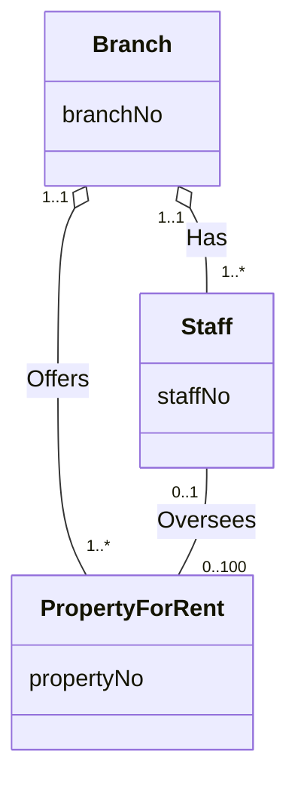

**Aggregation** represents a **"has-a"** or **"is-part-of"** relationship between entity types, where one is the **whole** and the other is the **part**.

- The part **can** exist without the whole.
- The part may be **shared** by many wholes.

In UML it's drawn as a **hollow diamond** on the *whole's* end of the relationship. The stricter version is [[Composition]].

*Examples of aggregation: Branch is the whole in both Has and Offers (slide 24)*

- **Has**: Branch = whole, Staff = part.
- **Offers**: Branch = whole, PropertyForRent = part.
- **Oversees** is an ordinary relationship with no diamond. Neither side is part of the other.
