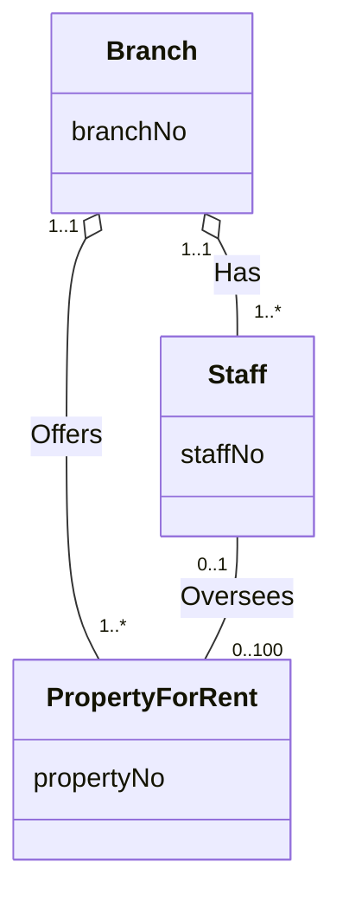

**Aggregation** represents a **"has-a"** or **"is-part-of"** [[Relationship Type]] between entity types, where one is the **whole** and the other is the **part**.

- UML notation: a **hollow diamond** on the *whole's* end of the line.
- The part **can exist without** the whole.
- The part **may be shared** by many wholes.
- A stronger form is [[Composition]].

*Branch as the whole in Has and Offers; Oversees is a plain association (slide 24)*

- `Staff` is the part in **Has**; `PropertyForRent` is the part in **Offers**; `Branch` is the whole in both.
