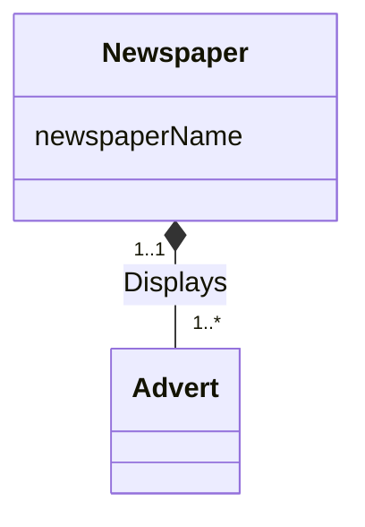

**Composition** is a specific, stronger form of [[Aggregation]]. There is **strong ownership** and a **coincidental lifetime** between the whole and the part: the whole is responsible for the disposition of its parts.

- The part **cannot** exist without the whole.
- The part belongs to **exactly one** whole.

In UML it's drawn as a **filled (solid) diamond** on the whole's end.

*Example of composition: Newspaper displays Adverts (slide 26)*

Newspaper is the whole and Advert is the part. An advert only exists as part of the one newspaper that displays it.

> [!tip] Composition vs. aggregation at a glance
> | | [[Composition]] ◆ | [[Aggregation]] ◇ |
> |---|---|---|
> | Can the part exist without the whole? | No | Yes |
> | How many wholes can own a part? | Exactly one | Many (can be shared) |
>
> Both are optional notation. Use them to *emphasize* that a relationship is a special whole/part one; an ordinary relationship line would be valid too.
