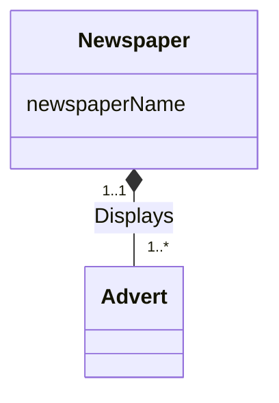

**Composition** is a specific, stronger form of [[Aggregation]] with **strong ownership** and a **coincidental lifetime** between the whole and the part — the whole is responsible for disposing of its parts.

- UML notation: a **filled diamond** on the *whole's* end of the line.
- The part **cannot exist without** the whole.
- The part **belongs to exactly one** whole.

*Newspaper (whole) displays Adverts (parts) (slide 26)*

> [!tip] When to use either
> Aggregation and composition are both just ways to **emphasize a special relationship** between entities — use them when the whole/part nature is worth making explicit.
