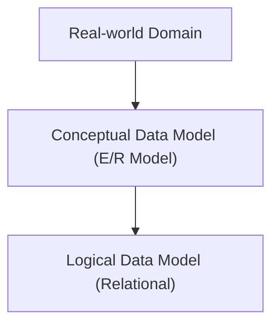

**Logical database design** is building a model of an organization's data on a *specific data model* (here, the relational model), while staying independent of any particular DBMS and of other physical details. It follows **conceptual database design**, which models the same data independent of *all* physical considerations. In this course the conceptual model is an [[Enhanced Entity-Relationship Model|(E)ER diagram]].

*Where each model sits in the design process (slide 3)*

For the relational model, the job is to turn every entity, relationship, and attribute identified in the conceptual model into **relations**, then validate those relations (using normalization, the next step).

| | Conceptual design | Logical design |
|---|---|---|
| Tied to a data model? | No | Yes (e.g. relational) |
| Tied to a DBMS / physical storage? | No | No |
| Output | (E)ER diagram | Relations with their keys |
