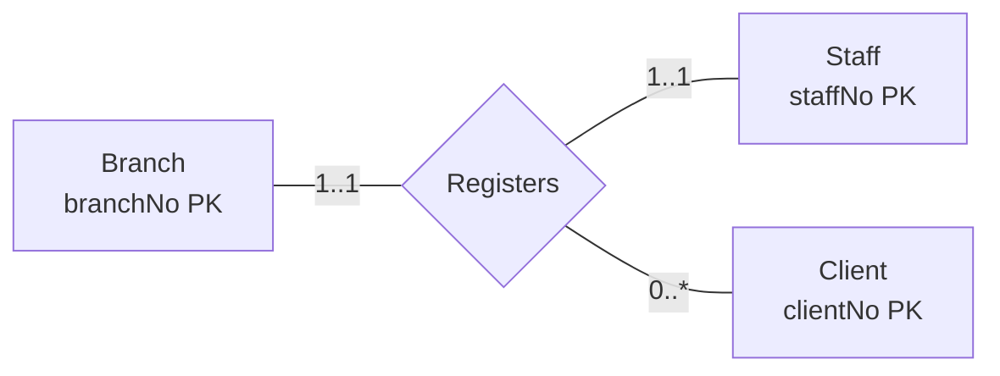

To map a **complex relationship** (ternary or higher), create a relation to represent the relationship, including any attributes that belong to it. Post a copy of the primary key of every participating entity into it as foreign keys. Any foreign key on a **"many" end** (e.g. `1..*`, `0..*`) generally forms part of the primary key, possibly combined with some of the relationship's own attributes.

It's the same idea as [[Mapping Many-to-Many Relationships]], extended to more than two entities.

## Example: Registers (Branch, Staff, Client)

*Ternary Registers relationship (slide 46)*

Only Client sits on a "many" end, so `clientNo` alone is the primary key. Fixing a client determines exactly one branch and one staff member.

> [!example] Result
> **Registration** (clientNo, branchNo, staffNo, dateJoined)
> Primary Key clientNo
> Foreign Key branchNo references Branch(branchNo)
> Foreign Key clientNo references Client(clientNo)
> Foreign Key staffNo references Staff(staffNo)

`dateJoined` is the relationship's attribute, shown on the full branch-view diagram (slide 4) but not on slide 46. The slide leaves the result blank, so check this against the lecture.

See [[Multiplicity]] for how multiplicity is read on an n-ary relationship.
