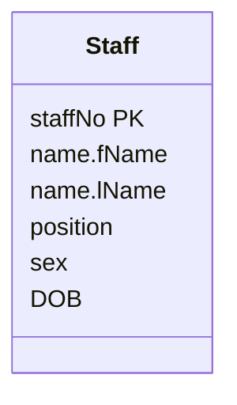
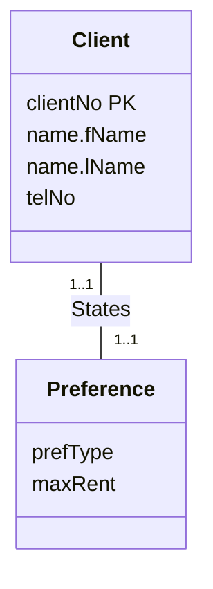

Steps 1 and 2 of deriving relations turn each [[Strong and Weak Entity Types|entity type]] into a relation.

- **Strong entity type**: create a relation with all its simple attributes. For a composite attribute, include only its simple parts (e.g. `name` becomes `fName`, `lName`).
- **Weak entity type**: create a relation with all its simple attributes, but its **primary key is derived partly or fully from each owner entity**. So the key can't be finalized until the relationship with the owner has been mapped.

## Strong entity: Staff

*Staff entity with composite attribute name (slide 22)*

> [!example] Result
> **Staff** (staffNo, fName, lName, position, sex, DOB)
> Primary Key staffNo

## Weak entity: Preference

*Client States Preference (slide 23)*

> [!example] Result
> **Preference** (prefType, maxRent)
> Primary Key *none yet*. It comes from the owner Client once the *States* relationship is mapped (see [[Mapping One-to-One Relationships]]).
