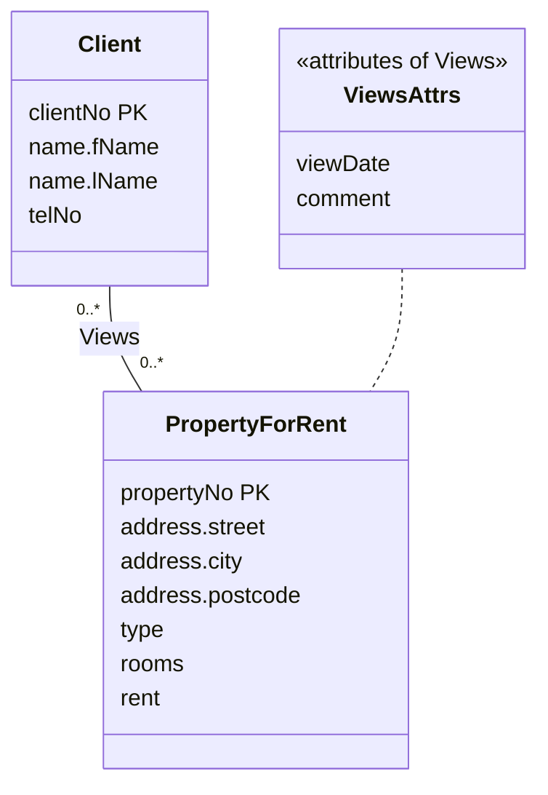

To map a **\*:\* binary relationship**, create a new relation to represent the relationship itself, including any attributes that belong to the relationship. Post a copy of the primary key of each participating entity into it as foreign keys. Together those foreign keys form the new relation's **primary key**, possibly combined with some of the relationship's own attributes.

A foreign key can't go into either entity's relation here, because each tuple on either side would need *many* values in one cell, breaking the atomic-value rule in [[Properties of Relations]].

## Example: Client Views PropertyForRent

*Client Views PropertyForRent, 0..\* to 0..\*, with relationship attributes (slide 44)*

(Mermaid can't attach an attribute box to a line, so the *Views* attributes are drawn as a separate stereotyped class.)

> [!example] Result
> **Viewing** (clientNo, propertyNo, dateView, comment)
> Primary Key clientNo, propertyNo
> Foreign Key clientNo references Client(clientNo)
> Foreign Key propertyNo references PropertyForRent(propertyNo)

> [!tip] When to add an attribute to the key
> The key `clientNo, propertyNo` allows only one viewing per client per property. If a client could view the same property more than once, the key would need `dateView` as well. This is the "possibly combined with relationship attributes" case.
