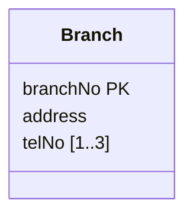

To map a **multi-valued attribute**, create a new relation to hold it, and include the owning entity's primary key as a foreign key. The new relation's primary key is the **multi-valued attribute plus the entity's primary key**, *unless* the multi-valued attribute is itself an alternate key of the entity, in which case it can be the primary key on its own.

A multi-valued attribute can't stay in the entity's relation, since each cell must hold one atomic value ([[Properties of Relations]]).

## Example: Branch telephone numbers

*Branch with up to three telephone numbers (slide 48)*

> [!example] Result
> **Branch** (branchNo, street, city, postcode)
> Primary Key branchNo
>
> **Telephone** (telNo, branchNo)
> Primary Key telNo
> Foreign Key branchNo references Branch(branchNo)

A phone number belongs to only one branch, so `telNo` uniquely identifies a Branch and is an alternate key. That's the exception case, so `telNo` alone is the primary key. If two branches could share a number, the key would be `telNo, branchNo`. The slide leaves the result blank, so check this against the lecture.
